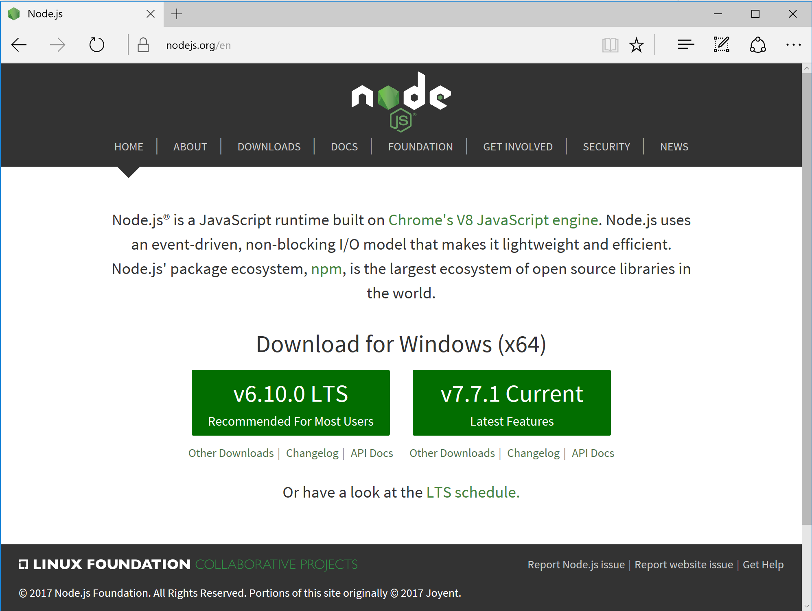
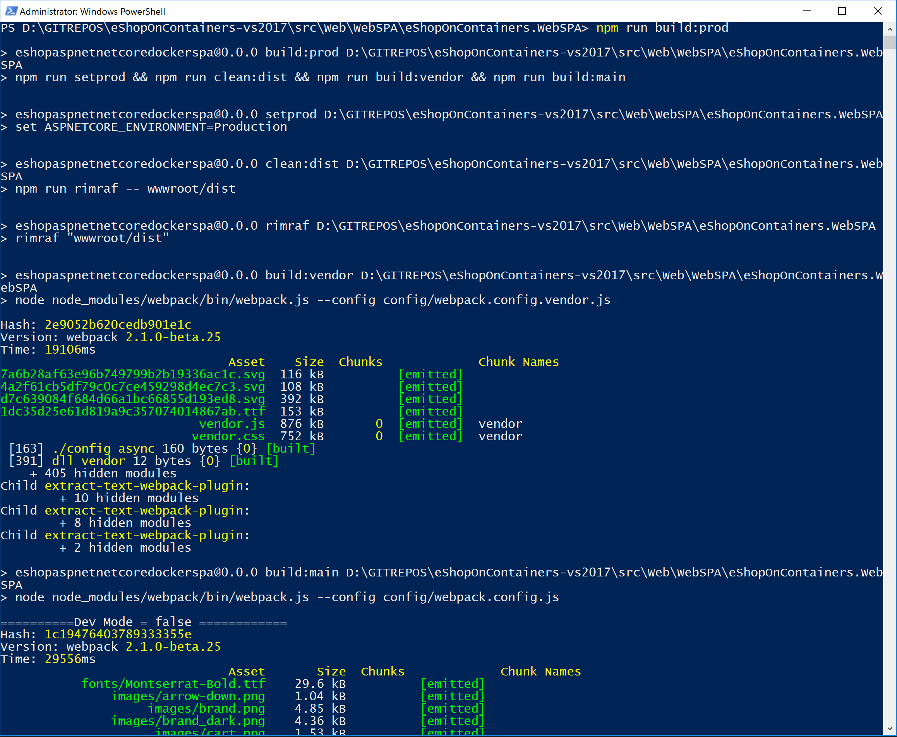
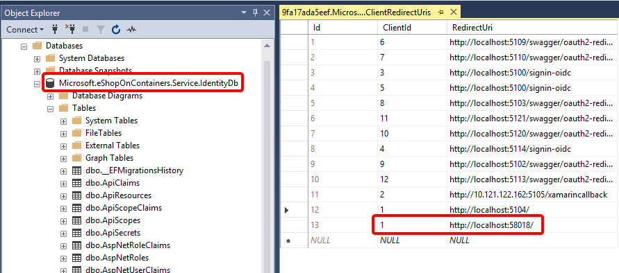
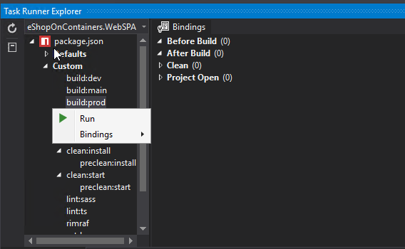

## Important notice

The Web SPA application currently builds just fine while building the Docker images with docker-compose.

**You only need to go through this article if you want to run it locally with Visual Studio, to build the required JavaScript code and dependencies.**

## Requirements and set up

### Install NPM

You need to use **npm** from the command line to build the JS application, so it has to be installed globally.

**NPM** is bundled with NODE.JS, and Installing NODE and NPM is pretty straightforward by using the installer package available at https://nodejs.org/en/

You can install the Long Term Support (LTS) version "Recommended For Most Users" of Node, however, the current version used in the WebSPA application is [8.11](https://nodejs.org/download/release/v8.11.4/).

You can also see the installed NPM version with the command `npm -v`, as shown below.

### Set NPM path into Visual Studio

This step is only required if you are also using the full Visual Studio 2017.

NPM (just installed by you) will be usually installed under this path:
**C:\Program Files\nodejs**.

You might need to update that path in Visual Studio under the "External Web Tools" location paths, as shown below:

If you don't do this step you might have issues because of using different versions from VS versus the command line accessing the same JavaScript code from both environments.
See:
http://www.hanselman.com/blog/VisualStudio2015FixingDependenciesNpmNotInstalledFromFseventsWithNodeOnWindows.aspx

### Build the SPA app with NPM

Now, you need to build the SPA app (TypeScript and Angular 6+ based client app) with NPM.

- Open a command-prompt window and move to the root of the SPA application (src\Web\WebSPA\)

- Run the command `npm install` as shown below:

  

  **IMPORTANT NOTE/UPDATE:** Seems like in some NPM environments running just "npm install" does not work properly. If you have a similar issue than [this issue](https://github.com/dotnet-architecture/eShopOnContainers/issues/253): try running **"npm install enhanced-resolve@3.3.0"** instead "npm install". (Please, provide your experience at that mentioned issue)

- Then, run the command `npm run build:prod` as shown below:

  

- If you get an error like **"Node Sass could not find a binding for your current environment: Windows 64-bit with Node.js 6.x"**, then run the command `npm rebuild node-sass` as in the following screenshot:

  

  Then, run again the `npm run build:prod` command that should finish with no errors.

  

### Run the SPA locally

To run the SPA locally you have to set the WebSPA as the startup project for the solution, and then press [F5] or [Ctrl+F5] as usual.

The SPA application should start in port 58018, but `localhost:58018` is not in one of the authorized client redirections in `Identity.API`, so this address has to be added manually.

The easiest is to just edit the database proper table and add the required record.

If using SQL Server Management Studio do the following:

1. Connect to `localhost, 5433` with username `sa` and password `Pass@word`

   

2. Find the table `dbo.ClientRedrectUris` in the `IdentityDb` database and add a new record like the one that contains `http://localhost:5104`, but with the `http://localhost:58018` as shown in the next image:

   

You should be able to run now the SPA application with VS, using [F5] or [Ctrl+F5] and log in as usual, as shown here:

### (Optional) Run NPM tasks from within Visual Studio 2017

As the chosen workload method when developing a client frontend app (JS frameworks, etc.), you, as a developer have to be able to trigger the npm tasks when you want.

Of course, you can always open a command prompt and run npm from the CLI as you just did in the steps above (which is, in fact, what most front-end developers do).

However, you can also run npm tasks inside Visual Studio if you install the following VS extension: https://marketplace.visualstudio.com/items?itemName=MadsKristensen.NPMTaskRunner

This extension adds the option to run npm tasks from the "Task Runner Explorer" (since, out of the box, only gulp/grunt tasks are supported by VS2017). After this extension is installed you can run npm tasks from inside VS2017 and also set build bindings if you want.

This extension honors the VS External Web Tools configuration, and allows you to use bindings, so if you want to run npm tasks automatically on every VS build, you could do so. This is not set as default in the eShopOnContainers provided code as it would slow down each VS build with the npm build tasks.

## Sending feedback and pull requests

We'd appreciate your feedback, improvements and ideas.

You can create new [issues](https://github.com/dotnet-architecture/eShopOnContainers/issues) or [pull requests](https://github.com/dotnet-architecture/eShopOnContainers/pulls) in this repo or send emails to [eshop_feedback@service.microsoft.com](mailto:eshop_feedback@service.microsoft.com)
