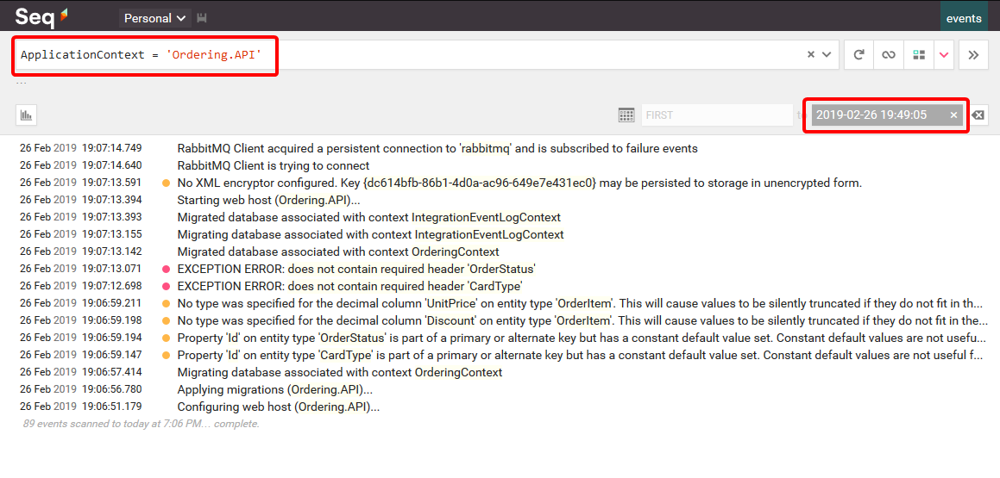
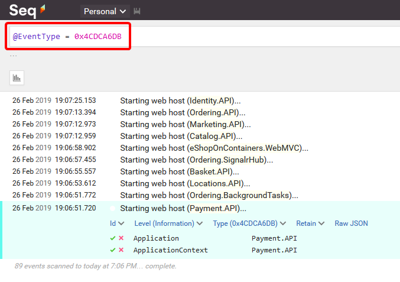
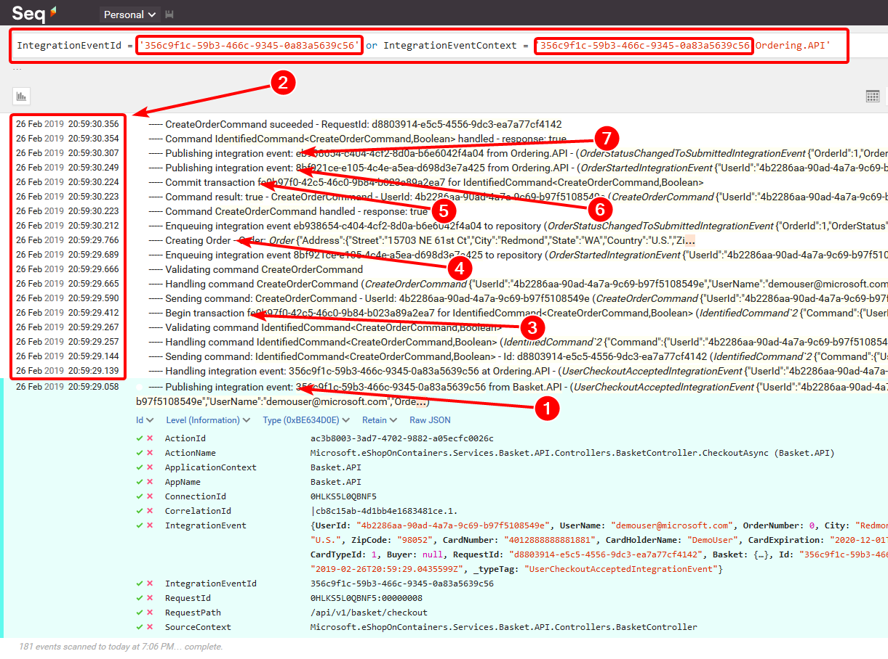
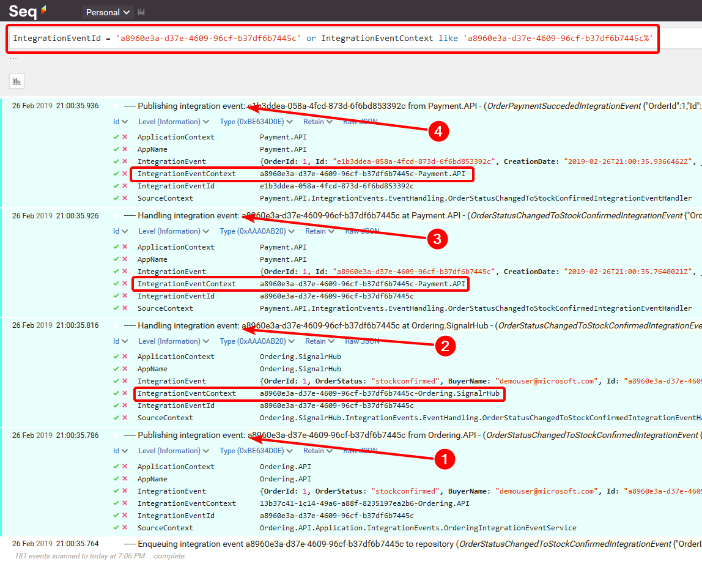
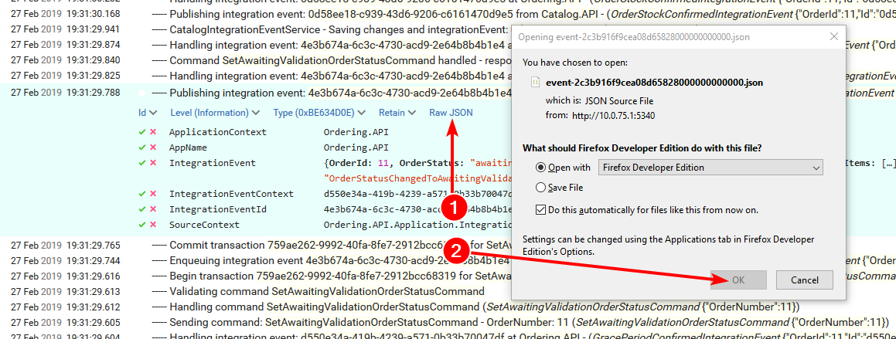

This article contains a brief introduction to centralized structured logging with [Serilog](https://serilog.net/) and event viewing with [Seq](https://getseq.net/) in eShopOnContainers.

Serilog is an [open source project in GitHub](https://github.com/serilog/serilog) and even though Seq is not, it's possible to [use it for free in development and small projects](https://getseq.net/Pricing), so it fits nicely for eShopOnContainers.

This article begins with a few sample use cases for logging, that also showcase the internals of some of the most interesting DDD patterns, that are not obvious by simply using the application.

Then we cover the most important tips for using structured logging in C# and conclude with some details on the setup of the logging system.

## Logging samples in eShopOnContainers

These are just a few samples of what you can get when you combine proper structured logging with filtering by some convenient properties, as seen from **Seq**.

The filter expression is highlighted on the top of each image.

### Application startup

Get the details of application startup:



Filtering by `ApplicationContext` shows all events from the application, in this sample we just added a `DateTime` limit to show only the initial traces.

The "level" of the events shown, such as `Debug`, `Information`, `Warning`, can be configured as explained in the [setup and configuration section](#setup-and-configuration).

### Closing in on a specific type of trace

You can focus on a specific type of trace by filtering by "event template" (for a specific `ApplicationContext` here):


You can also show the same event template or "type" for all applications:



### Integration event handling

Filtering by `IntegrationEventId` and `IntegrationEventContext` shows the publishing (1) and handling (2) of the `UserCheckoutAcceptedIntegrationEvent`. This handling begins a transaction (3), creates an order (4), commits the transaction (5) and publishes the events `OrderStartedIntegrationEvent` (6) and `OrderStatusChangedToSubmittedIntegrationEvent` (7).

Worth noting here is that integration events are queued while in the scope of the transaction, and then published after it finishes:



### Tracing an integration event from publishing to handling in other microservices

A filter similar to the previous one, but showing the logging event details, with an `OrderStatusChangedToStockConfirmedIntegrationEvent` published in `Ordering.API` (1) and handled in `Ordering.SignalrHub` (2) and in `Payment.API` (3). Notice that while still handling the event in `Payment.API`, a new `OrderPaymentSuccededIntegrationEvent` (4) is published:



### Viewing the log event details

If you use [Firefox Developer Edition](https://www.mozilla.org/firefox/developer/) or your browser has a JSON files viewer, you can get the raw JSON event:



And view or navigate/expand/colapse all event details much more easily:


## Using structured logging

This section explores the code-related aspects of logging, beginning with the "structured logging" concept that makes it possible to get the samples show above.

In a few word, **structured logging** can be thought of as a stream of key-value pairs for every event logged, instead of just the plain text line of conventional logging.

The key-value pairs are then the base to query the events, as was shown in the samples above.

### Getting the logger

The logging infrastructure of .NET supports structured logging when used with a `LoggerFactory`, such as **Serilog**, that supports it, and the simplest way to use is by requesting an `ILogger<T>` through Dependency Injection (DI) in the class constructor as shown here:

```cs
public class WorkerClass
{
    private readonly ILogger<WorkerClass> _logger;

    public WorkerClass(ILogger<WorkerClass> logger) => _logger = logger;

    // If you have to use ILoggerFactory, change the constructor like this:
    public WorkerClass(ILoggerFactory loggerFactory) => _logger = loggerFactory.CreateLogger<WorkerClass>();
}
```

The nice part of using the `ILogger<T>` is that you get a nice `SourceContext` property as shown here:


### Logging events

Logging events is pretty simple, as shown in the following code that produces the trace shown in image above:

```cs
_logger.LogInformation("----- Publishing integration event: {IntegrationEventId} from {AppName} - ({@IntegrationEvent})", pubEvent.EventId, Program.AppName, pubEvent.IntegrationEvent);
```

The code above is similar to what you've seen in the `string.format()` method, with three very important differences:

1. The first string defines a **type of event** or **template** property that can also be queried, along with any other of the event properties.

2. Every name in curly braces in the **template** defines a **property** that gets it's value from a parameter after the template, just as in `string.Format()`.

3. If a property name begins with `@` then the whole object graph is stored in the event log (some limits apply / can be configured).

#### Important logging rules

There a just a few simple rules to get the most from structured logging:

1. NEVER use string interpolation with variables as the template.

   If you use interpolation, then the "template" will lose it's meaning as an event type, you will also lose the key-value pairs and the trace will become a plain old simple text trace.

2. Log exceptions with the proper overload as shown in the following code fragments:

   ```cs
   catch (Exception ex)
   {
       _logger.LogWarning(ex, "Could not publish event: {EventId} after {Timeout}s ({ExceptionMessage})", @event.Id, $"{time.TotalSeconds:n1}", ex.Message);
   }

   .../...

   catch (Exception ex)
   {
       _logger.LogError(ex, "Program terminated unexpectedly ({Application})!", AppName);
       return 1;
   }

   ```

   Don't log only the exception message, because it would be like violating rule #1.

### Logging contexts and correlation Ids

Logging context allows you to define a scope, so you can trace and correlate a set of events, even across the boundaries of the applications involved. The use of different types of contexts was shown in the [logging samples section](#logging-samples-in-eshoponcontainers) above.

Correlation Ids are a mean to establish a link between two or more contexts or applications, but can get difficult to trace. At some point it might be better to handle contexts that cover business concepts or entities, such as an **OrderContext** that can be easily identified across different applications, even when using different technologies.

These are some of the context properties used in eShopOnContainers:

- **ApplicationContext** Is defined on application startup and adds the `ApplicationContext` property to all events.

- **SourceContext** Identifies the full name of the class where the event is logged, it's usually defined when creating or injecting the logger.

- **RequestId** Is a typical context that covers all events while serving a request. It's defined by the ASP.NET Core request pipeline.

- **Transaction context** Covers the events from the beginning of the database transaction up to it's commit.

- **IntegrationEventContext** - Identifies all events that occur while handling an integration event in an application.

## Setup and configuration

### Serilog

The logging setup used in eShopOnContainers is somewhat different from the usual samples in ASP.NET Core and it's taken mostly from <https://github.com/serilog/serilog-aspnetcore>. The main reason is to have logging services available as soon as possible during application startup.

These are the packages typically used to enable Serilog in the applications:

- Serilog.AspNetCore
- Serilog.Enrichers.Environment
- Serilog.Settings.Configuration
- Serilog.Sinks.Console
- Serilog.Sinks.Seq

Logger configuration is done in `Program.cs` as shown here:

```cs
private static Serilog.ILogger CreateSerilogLogger(IConfiguration configuration)
{
    var seqServerUrl = configuration["Serilog:SeqServerUrl"];

    return new LoggerConfiguration()
        .MinimumLevel.Verbose()
        .Enrich.WithProperty("ApplicationContext", AppName)
        .Enrich.FromLogContext()
        .WriteTo.Console()
        .WriteTo.Seq(string.IsNullOrWhiteSpace(seqServerUrl) ? "http://seq" : seqServerUrl)
        .ReadFrom.Configuration(configuration)
        .CreateLogger();
}
```

The following aspects can be highlighted from the code above:

- `.Enrich.WithProperty("ApplicationContext", AppName)` defines the `ApplicationContext` for all traces in the application.
- `.Enrich.FromLogContext()` allows you to define a log context anywhere you need it.
- `.ReadFrom.Configuration(configuration)` allows you to override the configuration from values in `appsettings.json`, or environment variables, which becomes very handy for containers.

The next JSON fragment shows the typical default configuration for `appsettings.json` eShopOnContainers microservices:

```json
"Serilog": {
    "SeqServerUrl": null,
    "MinimumLevel": {
        "Default": "Information",
        "Override": {
            "Microsoft": "Warning",
            "Microsoft.eShopOnContainers": "Information",
            "System": "Warning"
        }
    }
},
```

The previous JSON fragment shows how to configure the MinimumLevel for traces, according to the Namespace of the `SourceContext`, such that the default is **Information**, except for namespaces Microsoft.* and System.*, except again for **Microsoft.eShopOnContainers**, that's also Information.

### Seq

Seq is added as another container in the `docker-compose` files as shown here:

```yml
# In docker-compose.yml
services:
  seq:
    image: datalust/seq:latest

# in docker-compose.override.yml
  seq:
    environment:
      - ACCEPT_EULA=Y
    ports:
      - "5340:80"
```

With the above configuration **Seq** will be availiable at `http://10.0.75.1:5340` or `http://localhost:5340`

**Important configuration note**

To limit the amount of disk space used by the event store, it's recommended that you create a retention policy of **one day**, with the option: **settings > RETENTION > ADD POLICY -> Delete all events after 1 day**.

## Additional resources

- **Logging in ASP.NET Core** \
  <https://docs.microsoft.com/aspnet/core/fundamentals/logging/>

- **Serilog — simple .NET logging with fully-structured events** \
  <https://serilog.net/>

- **Seq — structured logs for .NET apps** \
  <https://getseq.net/>

- **Structured logging concepts in .NET Series (1)** \
  <https://nblumhardt.com/2016/06/structured-logging-concepts-in-net-series-1/>

- **Events and levels - structured logging concepts in .NET (2)** \
  <https://nblumhardt.com/2016/06/events-and-levels-structured-logging-concepts-in-net-2/>

- **Smart Logging Middleware for ASP.NET Core** \
  <https://blog.getseq.net/smart-logging-middleware-for-asp-net-core/>

- **Tagging log events for effective correlation** \
  <https://nblumhardt.com/2015/01/designing-log-events-for-effective-correlation/>)