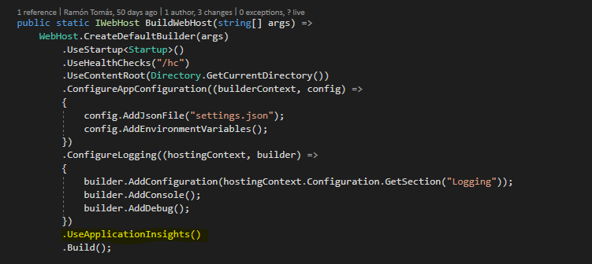
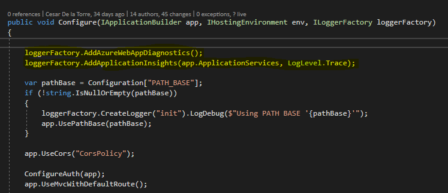
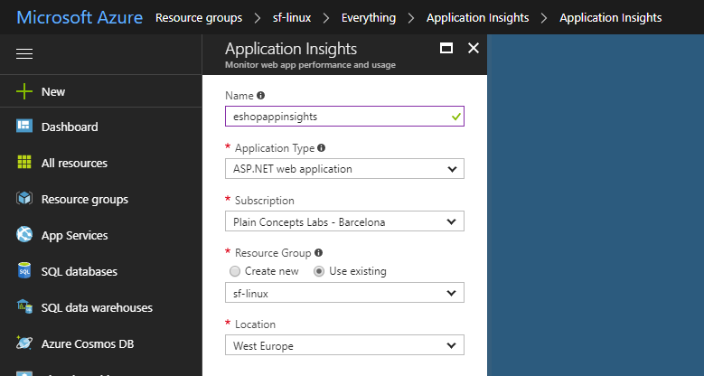
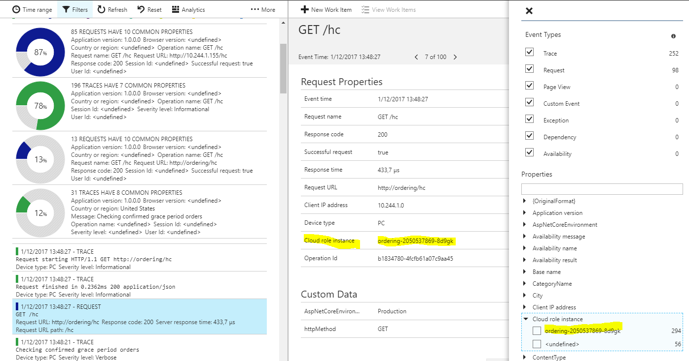

Follow the steps bellow to configure App Insights as a logging service. It is included the instructions for setting up App Insights in case you decide to register eShopOnContainers logs locally, or for instance in a cluster environment with Kubernetes or Service Fabric.

> **CONTENT**

- [Add Application Insights to an ASP.NET Core app](#add-application-insights-to-an-aspnet-core-app)
- [Create an App Insights service](#create-an-app-insights-service)
- [Setting up Application Insights locally](#setting-up-application-insights-locally)
- [Setting up Application Insights in Kubernetes](#setting-up-application-insights-in-kubernetes)
- [Application Insights filters](#application-insights-filters)

## Add Application Insights to an ASP.NET Core app

Install the following nuget packages:

- Microsoft.ApplicationInsights.AspNetCore
- Microsoft.ApplicationInsights.DependencyCollector

In case of deploying your app in a cluster environment, install these additional packages:

- Microsoft.ApplicationInsights.Kubernetes (for a Kubernetes environment)
- Microsoft.ApplicationInsights.ServiceFabric (for a Service Fabric environment)

Include the **UseApplicationInsights** extension method in your `webhostbuilder` located at program.cs:



Register AppInsights service by including the **AddApplicationInsightsTelemetry** extension method in your ConfigureServices Startup method located at Startup.cs. In case of using K8s or SF, add **EnableKubernetes** or **FabricTelemetryInitializer** method respectively:


To enable AppInsights in your ILogger,include the **AddAzureWebAppDiagnostics** and **AddApplicationInsights** ILoggerFactory extension method in your Configure Startup method located at Startup.cs:



## Create an App Insights service

Go to the Azure portal and create the service:

- Create Azure AppInsights

  

In case of using App Insights for logging eShopOnContainers in a cluster environment, Multi-role application map must be enabled:
- Enable Multi-role application map

   

Retrieve the Instrumentation Key generated to be used later on. Go to properties in the portal and copy the key.

## Setting up Application Insights locally

Go to the root of the project and open the **.env** file where all the environment variables are set, uncomment the **INSTRUMENTATION_KEY** variable and set the Instrumentation Key from your App Insights service that has previously been created: 

```
#ESHOP_AZURE_REDIS_BASKET_DB=<YourAzureRedisBasketInfo>
#ESHOP_AZURE_STORAGE_CATALOG_URL=<YourAzureStorage_Catalog_BLOB_URL>
#ESHOP_AZURE_STORAGE_MARKETING_URL=<YourAzureStorage_Marketing__BLOB_URL>
#ESHOP_AZURE_SERVICE_BUS=<YourAzureServiceBusInfo>
#ESHOP_AZURE_COSMOSDB=<YourAzureCosmosDBConnData>
#ESHOP_AZURE_CATALOG_DB=<YourAzureSQLDBCatalogDBConnString>
#ESHOP_AZURE_IDENTITY_DB=<YourAzureSQLDBIdentityDBConnString>
#ESHOP_AZURE_ORDERING_DB=<YourAzureSQLDBOrderingDBConnString>
#ESHOP_AZURE_MARKETING_DB=<YourAzureSQLDBMarketingDBConnString>
#ESHOP_AZUREFUNC_CAMPAIGN_DETAILS_URI=<YourAzureFunctionCampaignDetailsURI>
#ESHOP_AZURE_STORAGE_CATALOG_NAME=<YourAzureStorageCatalogName>
#ESHOP_AZURE_STORAGE_CATALOG_KEY=<YourAzureStorageCatalogKey>
#ESHOP_AZURE_STORAGE_MARKETING_NAME=<YourAzureStorageMarketingName>
#ESHOP_AZURE_STORAGE_MARKETING_KEY=<YourAzureStorageMarketingKey>
#ESHOP_SERVICE_BUS_USERNAME=<ServiceBusUserName-OnlyUsedIfUsingRabbitMQUnderwindows>
#ESHOP_SERVICE_BUS_PASSWORD=<ServiceBusUserPassword-OnlyUsedIfUsingRabbitMQUnderwindows>
INSTRUMENTATION_KEY=
#USE_LOADTEST=<True/False>
```

## Setting up Application Insights in Kubernetes

- Retrieve the Instrumentation Key from your AppInsights service properties. Open the **conf_local.yml** config file located in '/k8s' directory and set the variable **Instrumentation_Key** with the key.

```
  BasketBus: rabbitmq
  BasketRedisConStr: basket-data
  CatalogBus: rabbitmq
  CatalogSqlDb: Server=sql-data;Initial Catalog=Microsoft.eShopOnContainers.Services.CatalogDb;User Id=sa;Password=Pass@word;
  CatalogAzureStorageEnabled: "False"
  IdentitySqlDb: Server=sql-data;Initial Catalog=Microsoft.eShopOnContainers.Services.IdentityDb;User Id=sa;Password=Pass@word;
  LocationsBus: rabbitmq
  LocationsNoSqlDb: mongodb://nosql-data
  LocationsNoSqlDbName: LocationsDb
  MarketingBus: rabbitmq
  MarketingNoSqlDb: mongodb://nosql-data
  MarketingNoSqlDbName: MarketingDb
  MarketingSqlDb: Server=sql-data;Initial Catalog=Microsoft.eShopOnContainers.Services.MarketingDb;User Id=sa;Password=Pass@word;
  OrderingBus: rabbitmq
  OrderingSqlDb: Server=sql-data;Initial Catalog=Microsoft.eShopOnContainers.Services.OrderingDb;User Id=sa;Password=Pass@word;
  PaymentBus: rabbitmq
  UseAzureServiceBus: "False"
  EnableLoadTest: "False"
  keystore: keystore-data
  GracePeriodManager_GracePeriodTime: "1"
  GracePeriodManager_CheckUpdateTime: "15000"
  Instrumentation_Key: ""
```

## Application Insights filters

- Go to App Insights Search option in the Azure portal and check all the telemetry and traces that your app is generating.
- In a cluster environment with multiple containers with their own set of instances, notice that we can actually filter and trace logs by these service and instances: 


