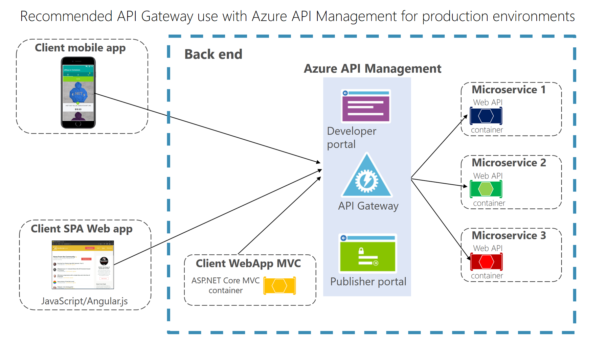
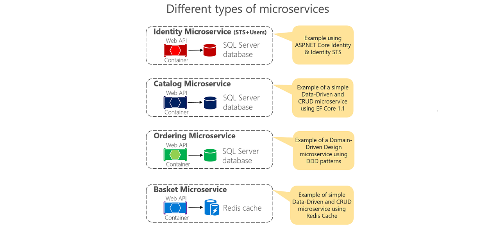

> **CONTENT**

- [Overview](#overview)
- [EventBus](#eventbus)
- [gRPC](#grpc)
- [API Gateways](#api-gateways)
- [Internal architectural patterns](#internal-architectural-patterns)
- [Database servers](#database-servers)
- [More on-line details and guidance](#more-on-line-details-and-guidance)

## Overview

This reference application is cross-platform for both the server and client side, thanks to .NET Core services, it's capable of running on Linux or Windows containers depending on your Docker host. It also has a Xamarin mobile app that supports Android, iOS and Windows/UWP, as well as an ASP.NET Core Web MVC and an SPA apps.

The architecture proposes a microservice oriented architecture implementation with multiple autonomous microservices (each one owning its own data/db). The microservices also showcase different approaches from simple CRUD to more elaborate DDD/CQRS patterns. HTTP is the communication protocol between client apps and microservices, and asynchronous message based communication between microservices.  Message queues can be handled either with RabbitMQ or Azure Service Bus, to convey integration events.

Domain events are handled in the ordering microservice, by using [MediatR](https://github.com/jbogard/MediatR), a simple in-process implementation the Mediator pattern.

## EventBus

eShopOnContainers includes a simplified EventBus abstraction to handle integration events, as well as two implementations, one based on [RabbitMQ](https://www.rabbitmq.com/) and another based on [Azure Service Bus](https://docs.microsoft.com/en-us/azure/service-bus/).

For a production-grade solutions you should use a more robust implementation based on a robust product such as [NServiceBus](https://github.com/Particular/NServiceBus). You can even see a (somewhat outdated) implementation of eShopOnContainers with NServiceBus here: https://github.com/Particular/eShopOnContainers.

## gRPC

Most communications between microservices are decoupled using the EventBus and the "pub/sub" pattern.

However, the communications between the custom aggregators and the internal microservices is currently implemented with gRPC, instead of HTTP/JSON. gRPC is a RPC-based protocol that has great performance and low bandwidth usage, making it the best candidate for internal microservices communication.

More information about gRPC and eShopOnContainers can be found [in the gRPC article in this wiki](./gRPC.md)

## API Gateways

The architecture also includes an implementation of the API Gateway and [Backends for Frontends (BFF)](https://samnewman.io/patterns/architectural/bff/) patterns, to publish simplified APIs and include additional security measures for hiding/securing the internal microservices from the client apps or outside consumers. 

These API Gateways are implemented using [Envoy](https://www.envoyproxy.io/), an OSS high-performant, production ready, proxy and API Gateway. Currently these API Gateways only perform request forwarding to internal microservices and custom aggregators, giving the clients then experience of a single base URL. Features that could be implemented in the future are:

- Automatic translation from/to gRPC to/from HTTP/REST.
- Authentication and Authorization management
- Cache support

If you need additional functionality and a much richer set of features suitable for commercial APIs, you can also add a full API Gateway product like [Azure API Management](https://azure.microsoft.com/services/api-management/) on top of these API Gateways.

Alongside the API Gateways a set of "custom aggregators" are provided. Those aggregators provide a simple API to the clients for some operations.

Currently two aggregators exists:

1. Mobile Shopping: Aggregator for shopping operations called by Xamarin App
2. Web Shopping: Aggregator for shopping operations called by Web clients (MVC & SPA)

>**Note** Previous versions of eShopOnContainers were using [Ocelot](https://github.com/ThreeMammals/Ocelot) instead of Envoy. Ocelot is a great .NET Core OSS open project, to create an API Gateway. Ocelot supports a wide set of features, and it's a serious candidate to be used in every :NET Core based project. However the lack of support for gRPC was the main reason to change Ocelot for Envoy in eShopOnContainers.

## Internal architectural patterns

There are different types of microservices according to their internal architectural pattern and approaches depending on their purposes, as shown in the image below.

## Database servers

There are four SQL Server databases, but they are all deployed to a single container, to keep memory requirements as low as possible. This is not a recommended approach for production deployment, where you should use high availability solutions.

There are also one Redis and one MongoDb instances, in separate containers, as a sample of two widely used NO-SQL databases.

## More on-line details and guidance

You can get more details on the related technologies and components in these selected articles from the [.NET Microservices architecture guide](https://docs.microsoft.com/dotnet/standard/microservices-architecture/):

- [Introduction to containers and Docker](https://docs.microsoft.com/dotnet/standard/microservices-architecture/container-docker-introduction/)

- [Key concepts of microservices container based applications](https://docs.microsoft.com/dotnet/standard/microservices-architecture/architect-microservice-container-applications/)
  - [Data sovereignty and eventual consistency](https://docs.microsoft.com/dotnet/standard/microservices-architecture/architect-microservice-container-applications/data-sovereignty-per-microservice)
  - [API gateways](https://docs.microsoft.com/dotnet/standard/microservices-architecture/architect-microservice-container-applications/direct-client-to-microservice-communication-versus-the-api-gateway-pattern)
  - [Communication in a microservices architecture](https://docs.microsoft.com/dotnet/standard/microservices-architecture/architect-microservice-container-applications/communication-in-microservice-architecture)
  - [Asynchronous message-based communications](https://docs.microsoft.com/dotnet/standard/microservices-architecture/architect-microservice-container-applications/asynchronous-message-based-communication)
  - [Resiliency](https://docs.microsoft.com/dotnet/standard/microservices-architecture/architect-microservice-container-applications/resilient-high-availability-microservices)
  - [Clusters and orchestrators](https://docs.microsoft.com/dotnet/standard/microservices-architecture/architect-microservice-container-applications/scalable-available-multi-container-microservice-applications)

- [Details on the eShopOnContainers sample application](https://docs.microsoft.com/dotnet/standard/microservices-architecture/multi-container-microservice-net-applications/)

- [Key concepts of Domain Driven Design (DDD) and Command and Query Responsibility Segregation (CQRS)](https://docs.microsoft.com/dotnet/standard/microservices-architecture/microservice-ddd-cqrs-patterns/)

- [Implementing resilient applications](https://docs.microsoft.com/dotnet/standard/microservices-architecture/implement-resilient-applications/)

- [Authentication and authorization](https://docs.microsoft.com/dotnet/standard/microservices-architecture/secure-net-microservices-web-applications/)

- [The development process for Docker-based applications](https://docs.microsoft.com/dotnet/standard/microservices-architecture/docker-application-development-process/)

