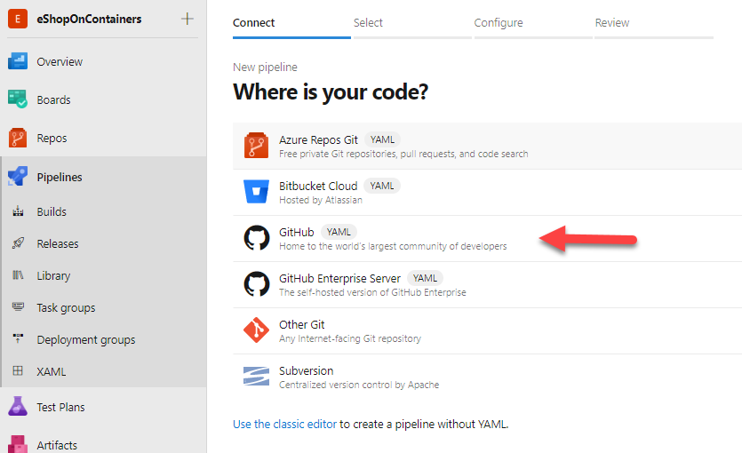
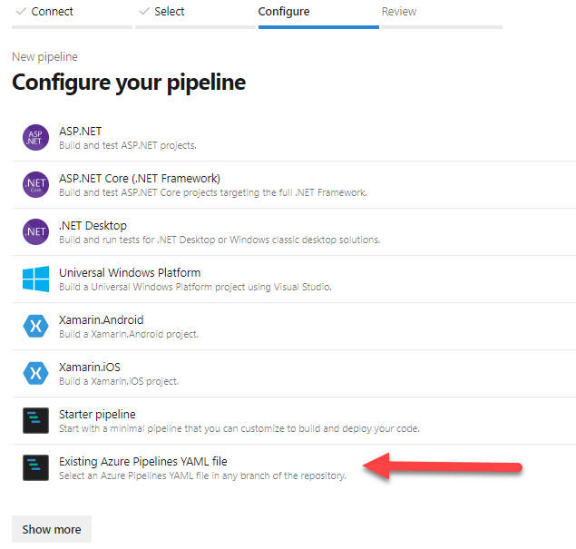
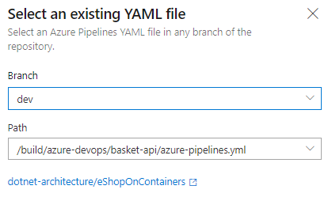
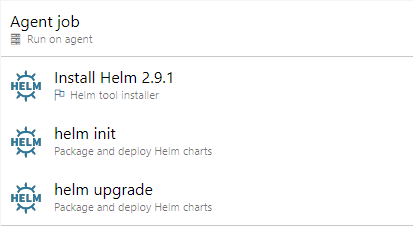
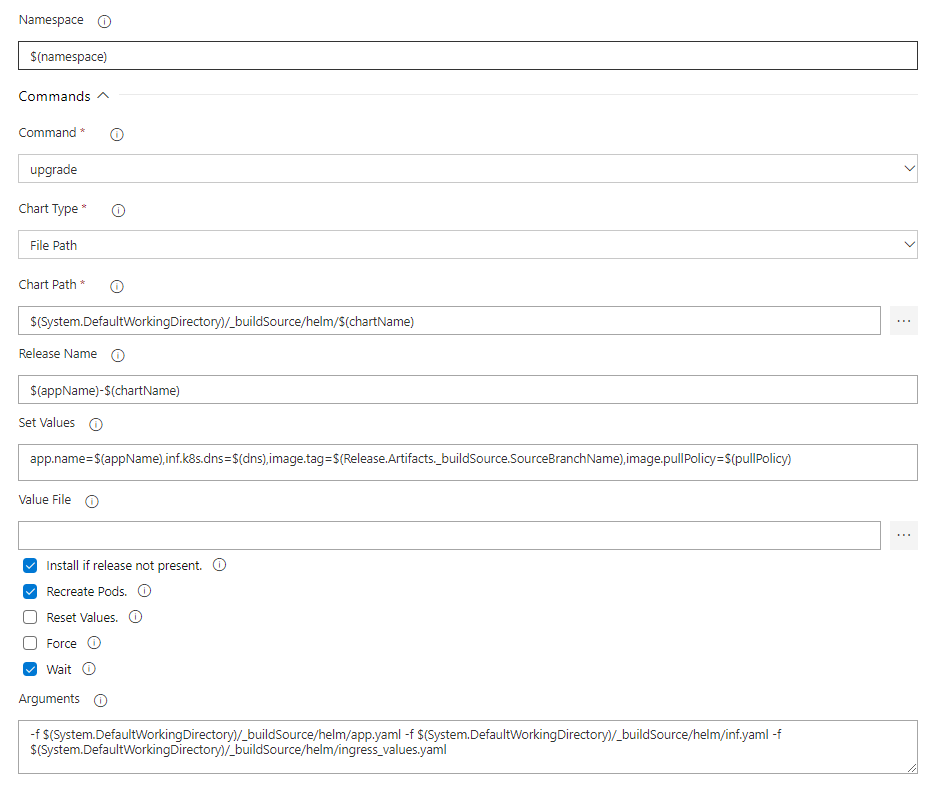

This page contains a brief setup description for CI/CD pipelines in Azure DevOps. `main` branch uses that.

> **CONTENT**

- [Build pipelines YAML definitions](#build-pipelines-yaml-definitions)
  - [Azure DevOps Build pipelines](#azure-devops-build-pipelines)
- [Pull Request Builds](#pull-request-builds)
- [Windows vs Linux images](#windows-vs-linux-images)
- [Release pipelines](#release-pipelines)
## Build pipelines YAML definitions

Folder `/build/azure-devops` has all the YAML files for all build pipelines. Although (for simplicity reasons) eShopOnContainers has all code in the same repo, we have one separated build per microservice. All builds have two jobs (named `BuildLinux` and `BuildWindows`) that build the Linux version and the windows version of the microservice.

We use _path filters_ to queue only the build when commits have files in certain paths. For example, this is the _path filters_ sections of the Web Status microservice:

```yaml
  paths:
    include:
    - src/BuildingBlocks/*
    - src/Web/WebStatus/*
    - k8s/helm/webstatus/* 
```

The build will be triggered if the commits have some file in these folders. Any other change won't trigger the build. Using _path filters_ we have the flexibility to use a single repository, separated builds and trigger only the needed builds.

Please, refer the [Azure DevOps YAML build pipelines documentation](https://docs.microsoft.com/azure/devops/pipelines/yaml-schema?view=azure-devops&tabs=schema) for more information.

### Azure DevOps Build pipelines

We have a build pipeline for each service in Azure DevOps created from the YAML file. To create build pipeline from an existing YAML file, create a new build pipeline in Azure DevOps:



Select the repository where you have the code (like GitHub) and select the repository where you have the eShopOnContainers code. Then in the _Configure_ tab select the option _Existing Azure Pipelines YAML file_:



Then you need to enter the YAML file to use:



In the _Review_ tab you'll see the content of the YAML file, and you could review (and update it if needed).

Once the build pipeline is created in Azure DevOps you can override some of its parameters (that is, the branches affected or if the build is a CI build or must be launched manually). For it, select the build pipeline and edit it. In the _review_ tab you can click the 3-dots-button to override the parameters:


## Pull Request Builds

We have enabled the build pipelines for Pull Request. There are some differences between a normal build and the build triggered by a PR though:

* The build triggered from a PR do not push the docker images to any docker registry.

## Windows vs Linux images

Each build generates the windows AND Linux images (note that we could have two separated builds instead). Build pushes the images to [eshop Dockerhub](https://hub.docker.com/u/eshop/).

* Linux image have tag `linux-<branch>` where `<branch>` is the git branch that triggered the build.
* Windows image have tag `win-<branch>` where `<branch>` is the git branch that triggered the build.

We have **multi-arch tags**, for the tags `dev`, `master` and `latest`, so you don't need to use `win-dev` or `linux-dev`, the tag `dev` will pick the right architecture automatically. Only this three tags have multi-arch, **and they are the only tags intended to be used**. The tag `dev` is the most updated.

## Release pipelines

We have an Azure DevOps Release pipeline per microservice. Source artifact for the release is the build.

All releases pipelines are very similar, as we use Helm to deploy to Kubernetes:



We use three Azure DevOps Tasks:

* A Helm task to install Helm in the build agent
* A Helm task to perform the `helm init`
* A Helm task to perform the `helm upgrade`

The helm upgrade task **uses the chart files which are produced as a build output** to install the helm chart from disk



Following arguments are passed to the task:

* Namespace where to install the release
* Chart Type as "File Path" as we are using the yaml files
* Chart Path: Path with the chart files (part of build output)
* Release Name: Name of the release to upgrade
* Set Values: The values to set to the chart. We have to pass the `inf.k8s.dns`and the image name and tag
* Mark the checkboxes: Install if not present, recreate pods and Wait
* Arguments: Additional yaml files needed
