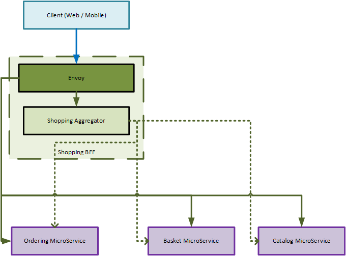

# BFF implementation

Current implementation of the [BFF pattern](https://samnewman.io/patterns/architectural/bff/) is as follow in the diagram:

**Note:** This schema only show one BFF. Each client type (web and mobile) has its own BFF.

The BFF is composed by two containers: One Envoy proxy and one custom aggregator (Note: The marketing BFF do not have custom aggregator, because has no complex logic).

## Envoy

An Envoy proxy acts a ingress for the BFF and **provides a single URL** for the client. All client calls go through the Envoy proxy. Then, based on the some rules, the Envoy proxy can:

1. Forward the call to the custom aggregator.
2. Forward the call directly to a internal microservice

## Custom aggregator

The custom aggregator is another container, that exposes a HTTP/JSON API and has complex methods, that involves data from various internal microservices. Each method of the custom aggregator calls one (or usually more than one) internal microservice, aggregates the results (applying custom logic) and returns data to the client.

All calls from the aggregator to microservices are performed using gRPC (dashed lines in diagram).

## Client Application

Client application calls the BFF only through the single URL exposed by the Envoy proxy. Based on the request data, the request is then forwarded to a internal microservice (single crud calls) or to the custom aggregaor (complex logic calls), but this is transparent to the client.

When the call is forwarded directly from Envoy to internal microservice, it is performed using HTTP/JSON. That implies, that, right now, internal microservices expose a mix of methods: some in gRPC (called by aggregators) and some in HTTP/JSON (called by Envoy). This is subject to change in the future (all microservices methods could be in gRPC and Envoy could automatically translate between gRPC and HTTP/JSON if needed).

