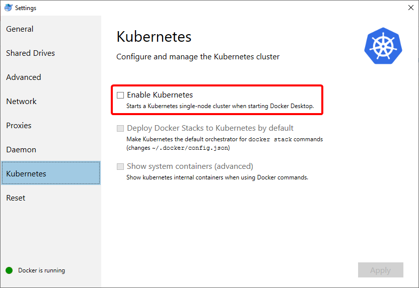
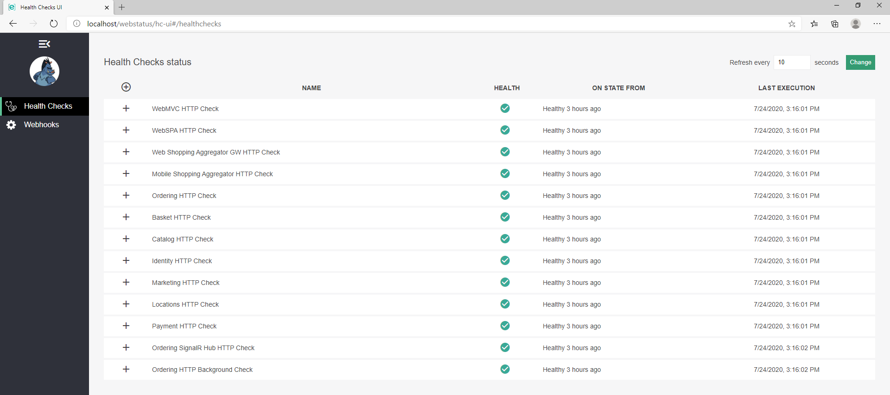

> **CONTENT**

- [Install/upgrade to the latest version of Docker for Desktop](#installupgrade-to-the-latest-version-of-docker-for-desktop)
- [Enable Kubernetes](#enable-kubernetes)
  - [Disable / stop Kubernetes](#disable--stop-kubernetes)
- [Install Helm](#install-helm)
  - [Install Helm client](#install-helm-client)
  - [Install Helm server (Tiller)](#install-helm-server-tiller)
- [Install the NGINX Ingress controller](#install-the-nginx-ingress-controller)
- [Install eShopOnContainers using Helm](#install-eshoponcontainers-using-helm)
  - [Deploy your local images](#deploy-your-local-images)
  - [Deploy the public official eShopOnContainer images from DockerHub](#deploy-the-public-official-eshoponcontainer-images-from-dockerhub)
  - [Check deployment status](#check-deployment-status)
- [Known issues](#known-issues)
- [Optional - Install Kubernetes Dashboard UI](#optional---install-kubernetes-dashboard-ui)
  - [IMPORTANT](#important)
- [Explore eShopOnContainers](#explore-eshoponcontainers)
- [Additional resources](#additional-resources)

## Install/upgrade to the latest version of Docker for Desktop

Start by installing or upgrading to the latest version of Docker Desktop for Windows, that includes Kubernetes support.

## Enable Kubernetes

To enable Kubernetes (k8s) click the **Enable Kubernetes** checkbox in the **Kubernetes** tab in **Docker Settings** and then click the "Apply" button.



If you also enable the "Show system containers" checkbox, you can see Kubernetes system containers running by using `docker ps`


This will start 11 containers in your Docker installation.

Your Docker Desktop Kubernetes installation already contains [kubectl](https://kubernetes.io/docs/reference/kubectl/overview/), which is the CLI to run Kubernetes commands and you'll need for the rest of steps here.

**IMPORTANT:** You'll also have to increase the memory allocated to Docker to at least **6144 MB**, because you'll have 70+ containers running after deploying eShopOnContainers.

### Disable / stop Kubernetes

If you ever want to remove Kubernetes from Docker Desktop, just disable Kubernetes in the **Settings > Kubernetes** page above and click "Apply".

You can stop/start the Kubernetes cluster from the Docker context menu, on the System tray:


## Install Helm

[Helm](https://helm.sh/) is the package manager for Kubernetes.

### Install Helm client

You can see the installation details in the [documentation page](https://helm.sh/docs/using_helm/#installing-helm).

The easiest way is probably to use a package manager, like [Chocolatey for Windows](https://chocolatey.org/).

Then install Helm from the package manager:

```powershell
choco install kubernetes-helm
```

### Install Helm server (Tiller)

To install Tiller:

- Go to the **k8s** folder in your local copy of the eShopOnContainers repo

- Create the Tiller service account by running:

    ```powershell
    kubectl apply -f helm-rbac.yaml
    ```

- Install tiller and configure it to use the tiller service account with the command:

    ```powershell
    helm init --service-account tiller
    ```

## Install the NGINX Ingress controller

[Ingress](https://kubernetes.io/docs/concepts/services-networking/ingress/) is an API object that allows access to your clustered services from the outside.

It's like a reverse proxy, that can handle load balancing, TLS, virtual hosting and the like.

[NGINX](https://github.com/kubernetes/ingress-nginx/blob/master/README.md) is the Ingress controller used for eShopOnContainers.

To install the NGINX Ingress controller, run the following commands:

1. `.\deploy-ingress.ps1`
2. `.\deploy-ingress-dockerlocal.ps1`

## Install eShopOnContainers using Helm

- Go to the **k8s\helm** folder in your local copy of the eShopOnContainers repo.

At this point you have two options for installing eShopOnContainers:

1. Use your local images or
2. Use the [public images from DockerHub (eshop)](https://hub.docker.com/u/eshop/) with tag `dev`

### Deploy your local images

The first task to deploy your local images is to create them, which you can achieve by just running this command from the CLI on the root folder of your local repo:

```powershell
docker-compose build
```

Then, just this script from the `k8s\helm` folder, to deploy your local images:

```powershell
.\deploy-all.ps1 -imageTag linux-latest -useLocalk8s $true -useLocalImages $true
```

The parameter `useLocalk8s` to `$true`, forces the script to use `localhost` as the DNS for all Helm charts and also creates the ingress with the correct ingress class.

When using the parameter `useLocalImages` to `$true`, helm tries to use the local images first, and if not available locally, pulls the official images from DockerHub.

### Deploy the public official eShopOnContainer images from DockerHub

If you prefer to deploy the public images (built from the **dev** branch on each commit), just run this script:

```powershell
.\deploy-all.ps1 -imageTag dev -useLocalk8s $true
```

### Check deployment status

After running the deployment script you can check the deployment status with the command:

```powershell
kubectl get deployment
```

After a while (could be ~5 min) you should get an output similar to this one:

```console
NAME                             DESIRED   CURRENT   UP-TO-DATE   AVAILABLE   AGE
eshop-apigwmm                    1         1         1            1           2h
eshop-apigwms                    1         1         1            1           2h
eshop-apigwwm                    1         1         1            1           2h
eshop-apigwws                    1         1         1            1           2h
eshop-basket-api                 1         1         1            1           2h
eshop-basket-data                1         1         1            1           2h
eshop-catalog-api                1         1         1            1           2h
eshop-identity-api               1         1         1            1           2h
eshop-keystore-data              1         1         1            1           2h
eshop-locations-api              1         1         1            1           2h
eshop-marketing-api              1         1         1            1           2h
eshop-mobileshoppingagg          1         1         1            1           2h
eshop-nosql-data                 1         1         1            1           2h
eshop-ordering-api               1         1         1            1           2h
eshop-ordering-backgroundtasks   1         1         1            1           2h
eshop-ordering-signalrhub        1         1         1            1           2h
eshop-payment-api                1         1         1            1           2h
eshop-rabbitmq                   1         1         1            1           2h
eshop-sql-data                   1         1         1            1           2h
eshop-webmvc                     1         1         1            1           2h
eshop-webshoppingagg             1         1         1            1           2h
eshop-webspa                     1         1         1            1           2h
eshop-webstatus                  1         1         1            1           2h
```

To check the public service exposed, run:

```powershell
kubectl get ing
```

You should get an output similar to this one:

```console
NAME                 HOSTS       ADDRESS     PORTS     AGE
eshop-apigwmm        localhost   localhost   80        2h
eshop-apigwms        localhost   localhost   80        2h
eshop-apigwwm        localhost   localhost   80        2h
eshop-apigwws        localhost   localhost   80        2h
eshop-identity-api   localhost   localhost   80        2h
eshop-webmvc         localhost   localhost   80        2h
eshop-webspa         localhost   localhost   80        2h
eshop-webstatus      localhost   localhost   80        2h
```

Note that ingresses are bound to DNS localhost and the host is also "localhost". So, you can access the **webspa** app in the address: `http://localhost` and the **MVC** in: `http://localhost/webmvc`

As this is the Docker local k8s cluster, you can see also the containers running on your machine.

If you type the command:

```powershell
docker ps
```

You should see them all (something similar to this):

```console
CONTAINER ID        IMAGE                            COMMAND                  CREATED             STATUS              PORTS               NAMES
fec1e3499416        a3f21ec4bd11                     "/entrypoint.sh /ngi…"   9 minutes ago       Up 9 minutes                            k8s_nginx-ingress-controller_nginx-ingress-controller-f88c75bc6-5xs2n_ingress-nginx_f1cc7094-e68f-11e8-b4b6-00155d016146_0
76485867f032        eshop/payment.api                "dotnet Payment.API.…"   2 hours ago         Up 2 hours                              k8s_payment-api_eshop-payment-api-75d5f9bdf6-6zx2v_default_4a3cdab4-e67f-11e8-b4b6-00155d016146_1
c2c4640ed610        eshop/marketing.api              "dotnet Marketing.AP…"   2 hours ago         Up 2 hours                              k8s_marketing-api_eshop-marketing-api-6b8c5989fd-jpxqv_default_45780626-e67f-11e8-b4b6-00155d016146_1
85301d538574        eshop/ordering.signalrhub        "dotnet Ordering.Sig…"   2 hours ago         Up 2 hours                              k8s_ordering-signalrhub_eshop-ordering-signalrhub-58cf5ff6-cnlm8_default_4932c344-e67f-11e8-b4b6-00155d016146_1
7a408a98000e        eshop/ordering.backgroundtasks   "dotnet Ordering.Bac…"   2 hours ago         Up 2 hours                              k8s_ordering-backgroundtasks_eshop-ordering-backgroundtasks-cc8f6d4d8-ztfk7_default_47f9cf10-e67f-11e8-b4b6-00155d016146_1
12c64b3a13e0        eshop/basket.api                 "dotnet Basket.API.d…"   2 hours ago         Up 2 hours                              k8s_basket-api_eshop-basket-api-658546684d-6hlvd_default_4262d022-e67f-11e8-b4b6-00155d016146_1
133fccfeeff3        eshop/webstatus                  "dotnet WebStatus.dll"   2 hours ago         Up 2 hours                              k8s_webstatus_eshop-webstatus-7f46479dc4-bqnq7_default_4dc13eb2-e67f-11e8-b4b6-00155d016146_0
00c6e4c52135        eshop/webspa                     "dotnet WebSPA.dll"      2 hours ago         Up 2 hours                              k8s_webspa_eshop-webspa-64cb8df9cb-dcbwg_default_4cd47376-e67f-11e8-b4b6-00155d016146_0
d4507f1f6b1a        eshop/webshoppingagg             "dotnet Web.Shopping…"   2 hours ago         Up 2 hours                              k8s_webshoppingagg_eshop-webshoppingagg-cc94fc86-sxd2v_default_4be6cdb9-e67f-11e8-b4b6-00155d016146_0
9178e26703da        eshop/webmvc                     "dotnet WebMVC.dll"      2 hours ago         Up 2 hours                              k8s_webmvc_eshop-webmvc-985779684-4br5z_default_4addd4d6-e67f-11e8-b4b6-00155d016146_0
1088c281c710        eshop/ordering.api               "dotnet Ordering.API…"   2 hours ago         Up 2 hours                              k8s_ordering-api_eshop-ordering-api-fb8c548cb-k68x9_default_4740958a-e67f-11e8-b4b6-00155d016146_0
12424156d5c9        eshop/mobileshoppingagg          "dotnet Mobile.Shopp…"   2 hours ago         Up 2 hours                              k8s_mobileshoppingagg_eshop-mobileshoppingagg-b54645d7b-rlrgh_default_46c00017-e67f-11e8-b4b6-00155d016146_0
65463ffd437d        eshop/locations.api              "dotnet Locations.AP…"   2 hours ago         Up 2 hours                              k8s_locations-api_eshop-locations-api-577fc94696-dfhq8_default_44929c4b-e67f-11e8-b4b6-00155d016146_0
5b3431873763        eshop/identity.api               "dotnet Identity.API…"   2 hours ago         Up 2 hours                              k8s_identity-api_eshop-identity-api-85d9b79f4-s5ks7_default_43d6eb7c-e67f-11e8-b4b6-00155d016146_0
7c8e77252459        eshop/catalog.api                "dotnet Catalog.API.…"   2 hours ago         Up 2 hours                              k8s_catalog-api_eshop-catalog-api-59fd444fb-ztvhz_default_4356705a-e67f-11e8-b4b6-00155d016146_0
94d95d0d3653        eshop/ocelotapigw                "dotnet OcelotApiGw.…"   2 hours ago         Up 2 hours                              k8s_apigwws_eshop-apigwws-65474b979d-n99jw_default_41395473-e67f-11e8-b4b6-00155d016146_0
bc4bbce71d5f        eshop/ocelotapigw                "dotnet OcelotApiGw.…"   2 hours ago         Up 2 hours                              k8s_apigwwm_eshop-apigwwm-857c549dd8-8w5gv_default_4098d770-e67f-11e8-b4b6-00155d016146_0
840aabcceaa9        eshop/ocelotapigw                "dotnet OcelotApiGw.…"   2 hours ago         Up 2 hours                              k8s_apigwms_eshop-apigwms-5b94dfb54b-dnmr9_default_401fc611-e67f-11e8-b4b6-00155d016146_0
aabed7646f5b        eshop/ocelotapigw                "dotnet OcelotApiGw.…"   2 hours ago         Up 2 hours                              k8s_apigwmm_eshop-apigwmm-85f96cbdb4-dhfwr_default_3ed7967a-e67f-11e8-b4b6-00155d016146_0
49c5700def5a        f06a5773f01e                     "docker-entrypoint.s…"   2 hours ago         Up 2 hours                              k8s_basket-data_eshop-basket-data-66fbc788cc-csnlw_default_3e0c45fe-e67f-11e8-b4b6-00155d016146_0
a5db4c521807        f06a5773f01e                     "docker-entrypoint.s…"   2 hours ago         Up 2 hours                              k8s_keystore-data_eshop-keystore-data-5c9c85cb99-8k56s_default_3ce1a273-e67f-11e8-b4b6-00155d016146_0
aae88fd2d810        d69a5113ceae                     "docker-entrypoint.s…"   2 hours ago         Up 2 hours                              k8s_rabbitmq_eshop-rabbitmq-6b68647bc4-gr565_default_3c37ee6a-e67f-11e8-b4b6-00155d016146_0
65d49ca9589d        bbed8d0e01c1                     "docker-entrypoint.s…"   2 hours ago         Up 2 hours                              k8s_nosql-data_eshop-nosql-data-579c9d89f8-mtt95_default_3b9c1f89-e67f-11e8-b4b6-00155d016146_0
090e0dde2ec4        bbe2822dfe38                     "/opt/mssql/bin/sqls…"   2 hours ago         Up 2 hours                              k8s_sql-data_eshop-sql-data-5c4fdcccf4-bscdb_default_3afd29b8-e67f-11e8-b4b6-00155d016146_0
```

## Known issues

Login from the webmvc results in following error: HttpRequestException: Response status code does not indicate success: 404 (Not Found).

The reason is because MVC needs to access the Identity Server from both outside the container (browser) and inside the container (C# code). Thus, the configuration uses always the *external url* of the Identity Server, which in this case is just `http://localhost/identity-api`. But this external url is incorrect when used from C# code, and the web mvc can't access the identity api. This is the only case when this issue happens (and is the reason why we use 10.0.75.1 for local address in web mvc in local development mode)

Solving this requires some manual steps:

From the `/k8s` folder run `kubectl apply -f .\nginx-ingress\local-dockerk8s\mvc-fix.yaml`. This will create two additional ingresses (for MVC and Identity API) to any valid DNS that points to your machine. This enable the use of 10.75.0.1 IP.

Update the `configmap` of Web MVC by typing (**line breaks are mandatory**):

```yml
kubectl patch cm cfg-eshop-webmvc --type strategic --patch @'
data:
  urls__IdentityUrl: http://10.0.75.1/identity
  urls__mvc: http://10.0.75.1/webmvc
'@
```

Update the `configmap` of Identity API by typing (**line breaks are mandatory**):

```yml
kubectl patch cm cfg-eshop-identity-api --type strategic --patch @'
data:
  mvc_e: http://10.0.75.1/webmvc
'@
```

Restart the SQL Server pod to ensure the database is recreated again:

```powershell
kubectl delete pod --selector app=sql-data
```

Wait until SQL Server pod is ready to accept connections and then restart all other pods:

```powershell
kubectl delete pod --selector="app!=sql-data"
```

**Note:** Pods are deleted to ensure the databases are recreated again, as identity api stores its client names and urls in the database.

Now, you can access the MVC app using: `http://10.0.75.1/webmvc`. All other services (like SPA) must be accessed using `http://localhost`

## Optional - Install Kubernetes Dashboard UI

You can deploy Kubernetes Web UI (Dashboard) to monitor the cluster locally.

To enable the dashboard:

1. Go to the **k8s** folder in your local copy of the eShopOnContainers repo.

2. Deploy the dashboard with this command:

    ```powershell
    kubectl apply -f https://raw.githubusercontent.com/kubernetes/dashboard/master/aio/deploy/recommended/kubernetes-dashboard.yaml
    ```

3. Create a sample admin user by running the script:

    ```powershell
    .\dashboard-adminuser.yaml
    ```

4. Bind admin-user to admin role by running the script:

    ```powershell
    .\dashboard-bind-adminrole.yml
    ```

5. Execute the dashboard by running this command:

    ```powershell
    kubectl proxy
    ```

6. Get the bearer token to login to the dashboard by running this command:

    ```powershell
    kubectl -n kube-system describe secret $(kubectl -n kube-system get secret | grep admin-user | awk '{print $1}')
    ```

    You should get something like this:

    ```console
    Name:         admin-user-token-95nxr
    Namespace:    kube-system
    Labels:       <none>
    Annotations:  kubernetes.io/service-account.name=admin-user
                  kubernetes.io/service-account.uid=aec979a2-7cb4-11e9-96aa-00155d013633

    Type:  kubernetes.io/service-account-token

    Data
    ====
    ca.crt:     1025 bytes
    namespace:  11 bytes
    token:      eyJhbGciOiJSUzI1NiIsImtpZCI...(800+ characters)...FkM_tAclj9o8T7ALdPZciaQ
    ````

7. Copy the token and navigate to: http://localhost:8001/api/v1/namespaces/kube-system/services/https:kubernetes-dashboard:/proxy/

8. Select "Token" and paste the copied the token in the "Enter token" filed: \
   \
   

You should see something like this:


From there you can explore all components of your cluster.

### IMPORTANT

You have to manually start the dashboard every time you restart the cluster, with the command:

```powershell
kubectl proxy
```

## Explore eShopOnContainers

After a while, when all services are running OK, you should get something like this:



- WebStatus: <http://localhost/webstatus>
- WebMVC: <http://10.0.75.1/webmvc>
- WebSPA: <http://10.0.75.1/webspa>

## Additional resources

- **Kubernetes Web UI setup** \
  <https://kubernetes.io/docs/tasks/access-application-cluster/web-ui-dashboard/>