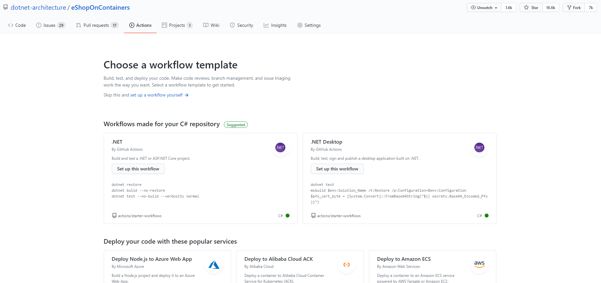
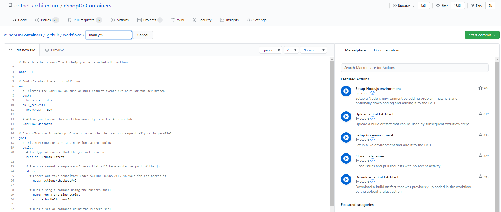

> This page contains a brief setup description for CI/CD pipelines in GitHub Actions workflows. `dev` branch uses that.

> **CONTENT**

- [Build workflows YAML definitions](#Build-workflows-YAML-definitions)
  - [GitHub Actions Build workflows](#github-actions-build-workflows)
- [On Pull Request Builds](#on-pull-request-builds)
- [On Push Builds](#pull-request-builds)

## Build workflows YAML definitions

Folder `/.github/workflows/` has all the YAML files for all build workflows. Although (for simplicity reasons) `eShopOnContainers` that has all code in the same repo, we have one separated build per microservice. All builds have two jobs (named `BuildContainersForPR_Linux` and `BuildLinux`) that build the Linux version of the microservice for each PR and push on the `dev` branch.

We use _path filters_ to queue only the build when commits have files in certain paths. For example, this is the _path filters_ sections of the Web Status microservice:

```yaml
  paths:
    - src/BuildingBlocks/**
    - src/Web/WebStatus/**
    - .github/workflows/webstatus.yml
```

The build will be triggered if the commits have some file in these folders. Any other change won't trigger the build. Using _path filters_ we have the flexibility to use a single repository, separated builds, and trigger only the needed builds.

Please, refer the [GitHub Actions](https://docs.github.com/en/actions) for more information.

### GitHub Actions Build workflows

We have a build workflow for each service in GitHub Actions created from the YAML file. To create the `build` workflow from an existing YAML file, create a new build workflow in GitHub Actions:



After choosing a new workflow, either you can define your workflow YAML from scratch or choose the Feature Actions from the Market place.
To define the workflow file, you can leverage the online YAML editor.



## On Pull Request Builds

We have enabled the build workflows for `pull_request` event on `dev` branch.For that each workflow has `BuildContainersForPR_Linux` job. There are some differences between a normal build and the build triggered by a PR though:

The build triggered from a PR do not push the docker images to any docker registry.


## On Push Builds

We have enabled the build workflows for `push` event on `dev` branch.
For that each workflow has `BuildLinux` job. Each push event builds the docker image and push it to the dockerhub.

