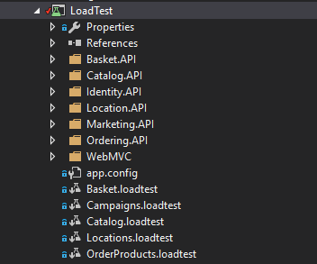
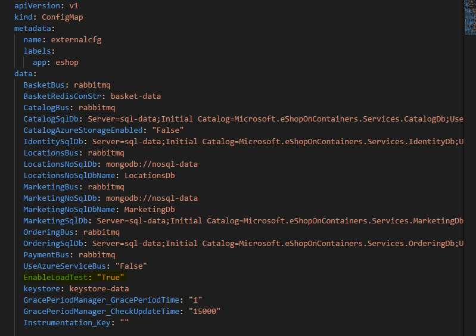
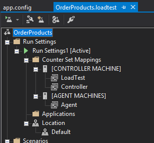

This folder details the setup needed to run load tests locally or on a Kubernetes / Service Fabric cluster.

Load testing requires Visual Studio Enterprise Edition

> **CONTENT**

- [Local environment](#local-environment)
- [Kubernetes environment](#kubernetes-environment)
- [Run Load Tests](#run-load-tests)



## Local environment

Modify the **app.config** file in the LoadTest project directory and set the following service urls.

```conf
<Servers>
    <MvcWebServer url="http://localhost:5100" />
    <CatalogApiServer url="http://localhost:5101" />
    <OrderingApiServer url="http://localhost:5102" />
    <BasketApiServer url="http://localhost:5103" />
    <IdentityApiServer url="http://localhost:5105" />
    <LocationsApiServer url="http://localhost:5109" />
    <MarketingApiServer url="http://localhost:5110" />
  </Servers>
```

Modify the **.env** file and set the following config property as shown bellow.

```env
USE_LOADTEST=True
```

## Kubernetes environment

Modify the **app.config** file in the LoadTest project directory and set the following service urls.

```conf
<Servers>
    <MvcWebServer url="http://<public_ip_k8s>/webmvc" />
    <CatalogApiServer url="http://<public_ip_k8s>/catalog-api" />
    <OrderingApiServer url="http://<public_ip_k8s>/ordering-api" />
    <BasketApiServer url="http://<public_ip_k8s>/basket-api" />
    <IdentityApiServer url="http://<public_ip_k8s>/identity" />
    <LocationsApiServer url="http://<public_ip_k8s>/locations-api" />
    <MarketingApiServer url="http://<public_ip_k8s>/marketing-api" />
  </Servers>
```

Modify the **conf_local.yml** file in the K8s directory and set the **EnableLoadTest** environment variable to True. This setting enables the load tests to bypass authorization in api services.



Deploy the Kubernetes services. Read the wiki pages related to Kubernetes setup:

- [Deploy to local Kubernetes](Deploy-to-Local-Kubernetes)
- [Deploy to Azure Kubernetes Service (AKS)](Deploy-to-Azure-Kubernetes-Service-(AKS))

## Run Load Tests

Open the load test you want to perform ***.loadtest** files and click the Run Load test button.

