This page covers the setup of your Mac development computer and assumes you've already:

- Ensured your system meets the [system requirements](System-requirements#Mac) and
- Installed Docker Desktop for Mac as directed in \
  <https://docs.docker.com/docker-for-mac/install/>.

The approach followed is to have the app running from the CLI first, since it's usually easier to deploy, and then go on to the option of using Visual Studio.

> **CONTENT**

- [Configure Docker](#configure-docker)
  - [Memory and CPU](#memory-and-cpu)
  - [Shared folders](#shared-folders)
- [Configure local networking](#configure-local-networking)
  - [Setting up the docker-compose environment variables and settings](#setting-up-the-docker-compose-environment-variables-and-settings)
- [Build and deploy eShopOnContainers](#build-and-deploy-eshoponcontainers)
  - [1. Create a folder for your repositories](#1-create-a-folder-for-your-repositories)
  - [2. Clone eShopOnContainer's GitHub repo](#2-clone-eshoponcontainers-github-repo)
  - [3. Build the application](#3-build-the-application)
  - [4. Deploy to the local Docker host](#4-deploy-to-the-local-docker-host)
  - [5. Check the running containers](#5-check-the-running-containers)
- [Explore the application](#explore-the-application)
- [Optional - Use Visual Studio for Mac](#optional---use-visual-studio-for-mac)
  - [Open the solution with Visual Studio for Mac](#open-the-solution-with-visual-studio-for-mac)
  - [Build and run the application with F5 or Ctrl+F5](#build-and-run-the-application-with-f5-or-ctrlf5)
- [Explore the code](#explore-the-code)
- [Configuring the app for external access from remote client apps](#configuring-the-app-for-external-access-from-remote-client-apps)

## Configure Docker

The initial Docker for Desktop configuration is not suitable to run eShopOnContainers because the app uses a total of 25 Linux containers.

Even though the microservices are rather light, the application also runs SQL Server, Redis, MongoDb, RabbitMQ and Seq as separate containers. The SQL Server container has four databases (for different microservices) and takes an important amount of memory.

So it's important to configure enough memory RAM and CPU to Docker.

### Memory and CPU

Once Docker for Mac is installed, configure the minimum amount of memory and CPU like so:

- Memory: 4096 MB
- CPU: 2

This amount of memory is the absolute minimum to have the app running, and that's why you need a 16GB RAM machine for optimal configuration.

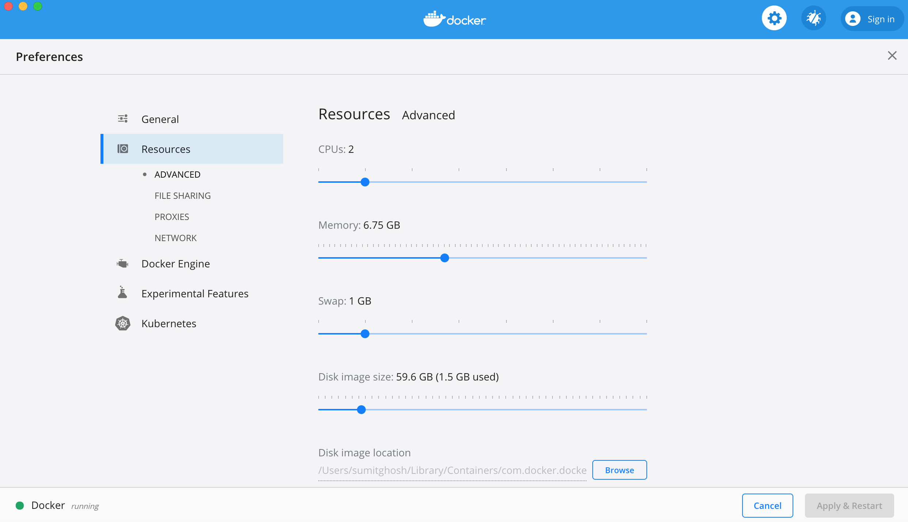

Depending on how many apps you are running in your Mac you might need to assign more memory to Docker in the Mac. Usually, 4GB should suffice, but we've got feedback from developers who've needed to assign up to 8GB of RAM to Docker in the Mac.

### Shared folders

If your projects are placed within the /Users folder, you don't need to configure anything additional, as that is a pre-shared folder. However, if you place your projects under a different path, like /MyRootProjects, then you'd need to add that shared folder to Docker's configuration.

If using Visual Studio for Mac, it is also important that you share the folder `/usr/local/share/dotnet`, like here:


## Configure local networking

This configuration is necessary so you don't get the following error when trying to login in the MVC web app.

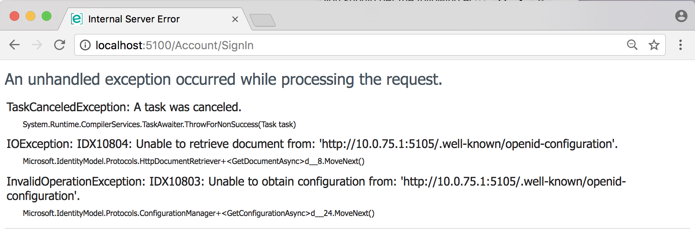


That is because the by default IP used to redirect to the Identity service/app used by the application (based on IdentityServer4) is the IP 10.0.75.1.
That IP is always set up when installing Docker for Windows in a Windows 10 machine. It is also used by Windows Server 2016 when using Windows Containers. 

eShopOnContainers uses that IP as the "by default choice" so anyone testing the app don't need to configure further settings. However, that IP is not used by "Docker for Mac", so you need to change the config.

If you were to access the Docker containers from remote machines or mobile phones, like when using the Xamarin app or the web apps in remote PCs, then you would also need to change that IP and use a real IP from the network adapter.

### Setting up the docker-compose environment variables and settings

As explained [here by Docker](https://docs.docker.com/docker-for-mac/networking/#use-cases-and-workarounds), 
the Mac has a changing IP address (or none if you have no network access). From June 2017 onwards our recommendation is to connect to the special Mac-only DNS name docker.for.mac.localhost which will resolve to the internal IP address used by the host.

In the `docker-compose.override.yml` file, replace the IdentityUrl environment variable (or any place where the IP 10.0.75.1 is used) with:

 ```bash
    IdentityUrl=http://docker.for.mac.localhost:5105
 ```

You could also set your real IP at the Mac's network adapter. But that would be a worse solution as it'll depend on the network you are connecting your Mac development machine.. 

Therefore, the WebMVC service definition at the `docker-compose.override.yml` should finally be configured as shown bellow:

 ```bash
  webmvc:
    environment:
      - ASPNETCORE_ENVIRONMENT=Development
      - ASPNETCORE_URLS=http://0.0.0.0:80
      - CatalogUrl=http://catalog.api
      - OrderingUrl=http://ordering.api
      - BasketUrl=http://basket.api
      - LocationsUrl=http://locations.api
      - IdentityUrl=http://docker.for.mac.localhost:5105
      - MarketingUrl=http://marketing.api
      - CatalogUrlHC=http://catalog.api/hc
      - OrderingUrlHC=http://ordering.api/hc
      - IdentityUrlHC=http://identity.api/hc
      - BasketUrlHC=http://basket.api/hc
      - MarketingUrlHC=http://marketing.api/hc
      - PaymentUrlHC=http://payment.api/hc
      - UseCustomizationData=True
      - ApplicationInsights__InstrumentationKey=${INSTRUMENTATION_KEY}
      - OrchestratorType=${ORCHESTRATOR_TYPE}
      - UseLoadTest=${USE_LOADTEST:-False}
    ports:
      - "5100:80"
 ```

If you re-deploy with `docker-compose up`, now the login page should work properly, as in the screenshot below.

NOTE: For some reason, if using SAFARI browser, it cannot reach docker.for.mac.localhost but using Chrome in Mac, it works with no issues. Since the usage of docker.for.mac.localhost is just for development purposes, just use Chrome for tests.

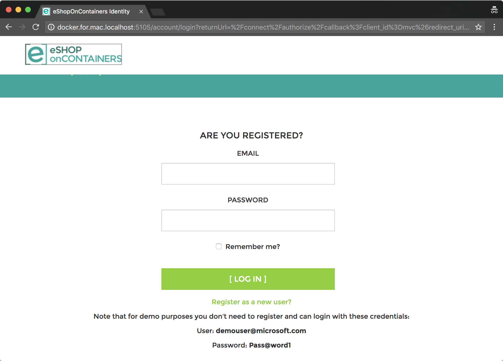

There's some additional configuration that's necessary in case you want to connect to the app from the Xamarin app or from the WiFi network, out the computer where the app is installed. You can find the detailed explanation at the end of his page.

## Build and deploy eShopOnContainers

At this point you should be able to run eShopOnContainers from the command line. To do that, you should:

### 1. Create a folder for your repositories

```console
cd
md MyGitRepos
cd MyGitRepos
```

This will create folder `/Users/<username>/MyGitRepos` will be fine.

### 2. Clone [eShopOnContainer's GitHub repo](https://github.com/dotnet-architecture/eShopOnContainers)

```console
git clone https://github.com/dotnet-architecture/eShopOnContainers.git
```

**Note:** Remember that the active development is done in `dev` branch. To test the latest code, use this branch instead of `master`.

### 3. Build the application

```console
cd eShopOnContainers
docker-compose build
```

While building the docker images should take between 15 and 30 minutes to complete, depending on the system speed.

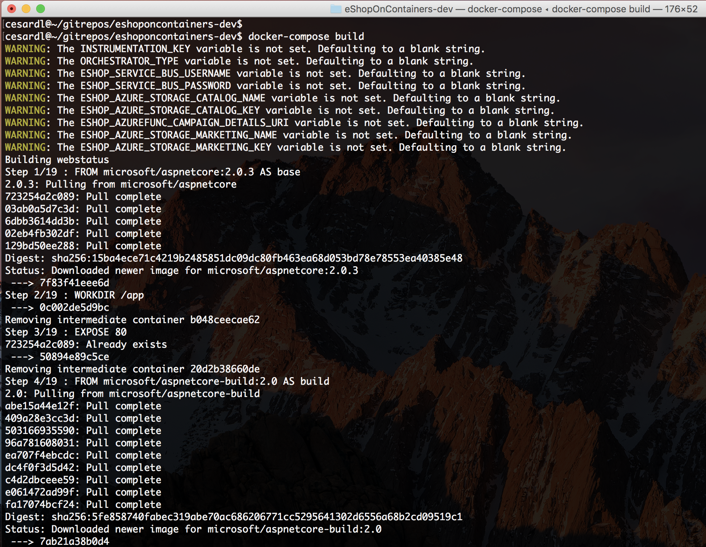

The first time you run this command it'll take some more additional time as it needs to pull/download the dotnet/core/aspnet and SDK images, so it'll take its time.

Later on you can try adding a parameter to speed up the image building process:

```console
cd eShopOnContainers
docker-compose build --build-arg RESTORECMD=scripts/restore-packages
```

When the `docker-compose build` command finishes, you can check out with Docker CLI the images created with the following Docker command:

```console
docker images
```

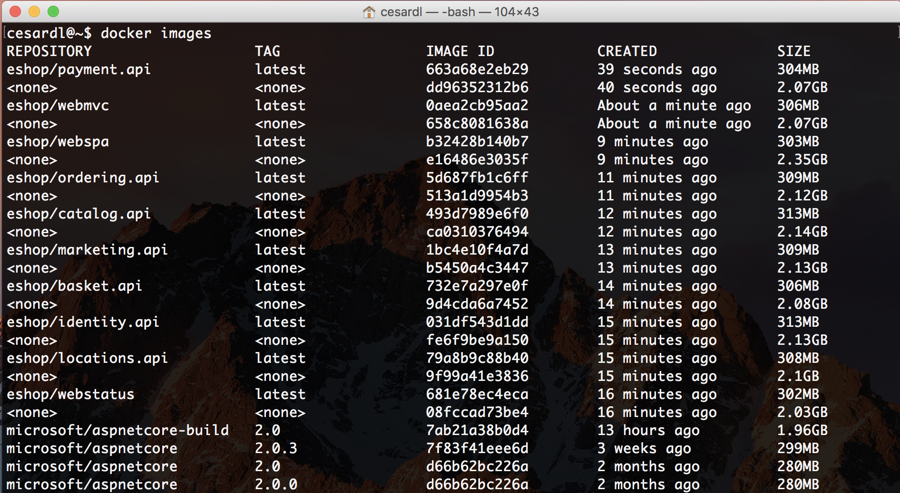

Those are the Docker images available in your local image repository.

You might have additional images, but you should see, at least, the the custom images starting with the prefix "eshop/" which is the name of the eShopOnContainers images repo. 

The images starting with `<none>` haven't been tagged with a name and are intermediate images of the build process. Other named images that don't start with "eshop/" are official base-images like the microsoft/aspnetcore or the SQL Server for Linux images.

### 4. Deploy to the local Docker host

```console
docker-compose up
```

With the above single command you deploy the whole solution into your local Docker host. You should view something like this in the first seconds:

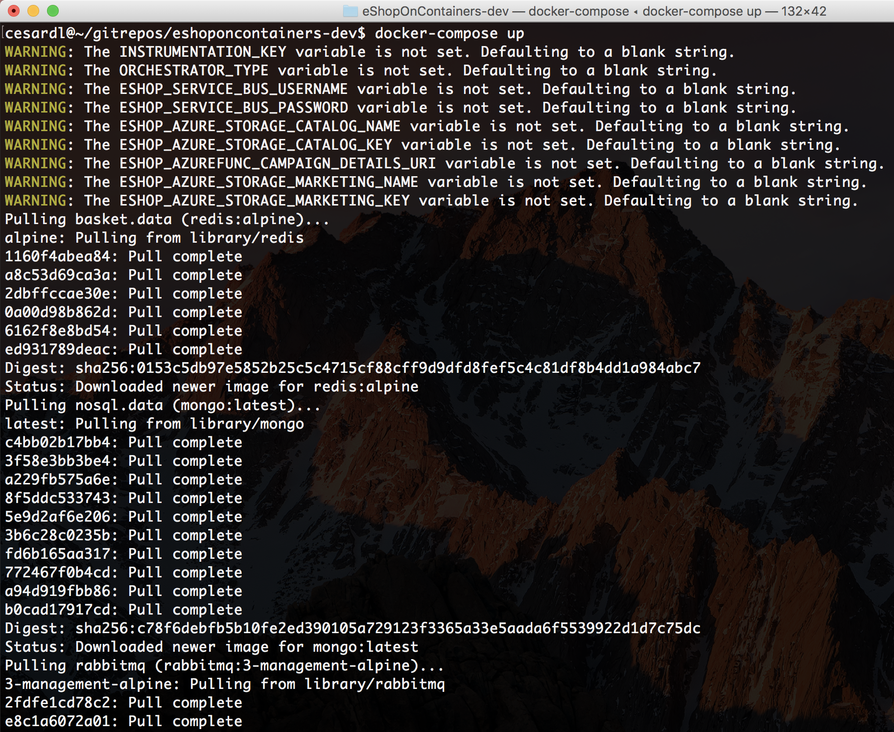

Ignore the warnings about environment variables for Azure, as that's only needed when deploying to Azure (Azure SQL Database, Redis as a service, Azure Service Bus, etc.) which is the "next step" when using eShopOnContainers.

Note that the first time you deploy the application (with docker run or docker-compose) it detects that it needs a few related infrastructure images, like the SQL Server, Redis, RabbitMQ images, and the like. So it'll pull or download those base images from the public Docker registry named DOCKER HUB, by pulling the "microsoft/mssql-server-linux" which is the base image for the SQL Server for Linux on containers, and the "library/redis" which is the base Redis image, and so on. Therefore, the first time you run "docker-compose up" it might take a few minutes pulling those images before it spins up your custom containers.

After a few more seconds, when all containers are deployed, you should see something like this:


The next time you run "docker-compose up", the app will start much faster, because all base images will already be downloaded and ready to go.

To stop all container you should just press Ctrl-C on the above terminal.

### 5. Check the running containers

Open a new terminal to view the running containers with the following command:

```console
docker ps
```

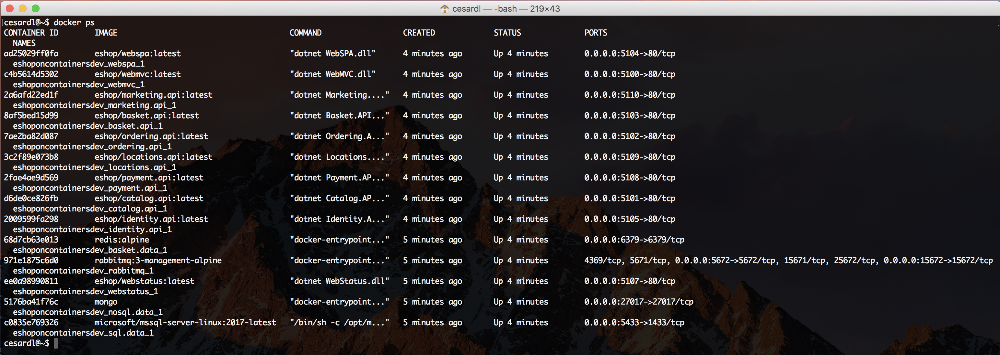

## Explore the application

You can now [explore the application](Explore-the-application) or continue with the optional Visual Studio for Mac setup.

## Optional - Use Visual Studio for Mac

If you want to explore the code and debug the application to see it working, you have to install Visual Studio for Mac.

When installing [Visual Studio for Mac](https://www.visualstudio.com/vs/visual-studio-mac/), you can select between multiple workloads or platforms.

Make sure you select the .NET Core platform:

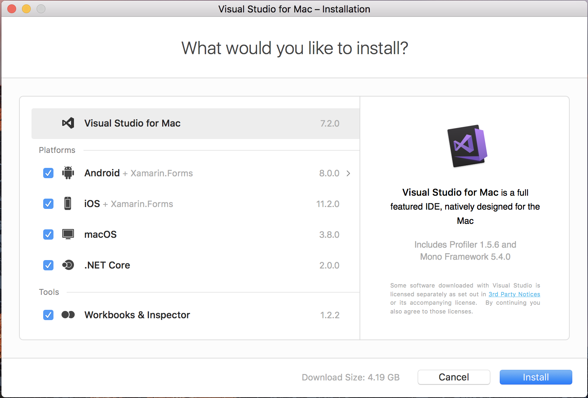

Before completing the VS for Mac installation, it will demand you to install XCode, that is needed for multiple dependencies.

If you install Android as a target platform, Java will also be installed as a dependency for building mobile apps for Android.

For running just the Docker containers and web apps, you'd just need the .NET Core platform.

But if you want to try the eShopOnContainers mobile app, that requires Xamarin and therefore, the iOS and Android platforms, too. Those mobile platforms are optional for this Wiki walkthrough, though.

**Make sure you have the latest SDK 2.2 version from <https://dotnet.microsoft.com/download/dotnet-core/2.2> installed.**

### Open the solution with Visual Studio for Mac

Run Visual Studio for Mac and open the solution `eShopOnContainers-ServicesAndWebApps.sln`.

If you just want to run the containers/microservices and web apps, do NOT open the other solutions, like `eShopOnContainers.sln` as those solutions will also open the Xamarin projects and that might slow you down when testing due to additional dependencies in VS.

After opening the `eShopOnContainers-ServicesAndWebApps.sln` solution for the first time, it is recommended to wait for a few minutes as VS will be restoring many NuGet packages and the solution won't be able to compile or run until it gets all the nuGet packages dependencies, in the first place (this time is only needed the first time you open the solution. Next times it is a lot faster).

This is VS for Mac with the `eShopOnContainers-ServicesAndWebApps.sln` solution. 

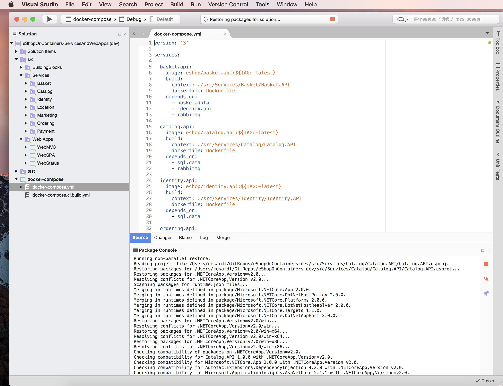

### Build and run the application with F5 or Ctrl+F5

Make sure that the by default start-up project is the Docker project named `docker-compose`.

Hit Ctrl+F5 or press the "play" button in VS for Mac.

IMPORTANT: The first time you run eShopOnContainers, it will take longer than the next time you launch it. Under the covers, Docker is pulling quite a few "heavy" images from Docker Hub (the public image registry), like the SQL Server image, Redis image, RabbitMQ image and the base ASP.NET Core images. That pull/download process will take a few minutes. Then, VS will launch the application custom containers plus the infrastructure containers (SQL, Redis, RabbitMQ and MongoDB), populate sample data in the databases and finally run the microservices and web apps on custom containers.

Note that you will see normal/controlled Http exceptions caused by our retries with exponential backoff, as the web apps have to wait until the microservices are ready for the first time which need first to run SQL sentences populating sample data, etc. 

Once the solution is up and running, you should be able to see it in the browser at:

http://localhost:5100


If you open a bash window, you can type `docker images` and see the pulled/downloaded images plus the custom images created by VS for Mac:

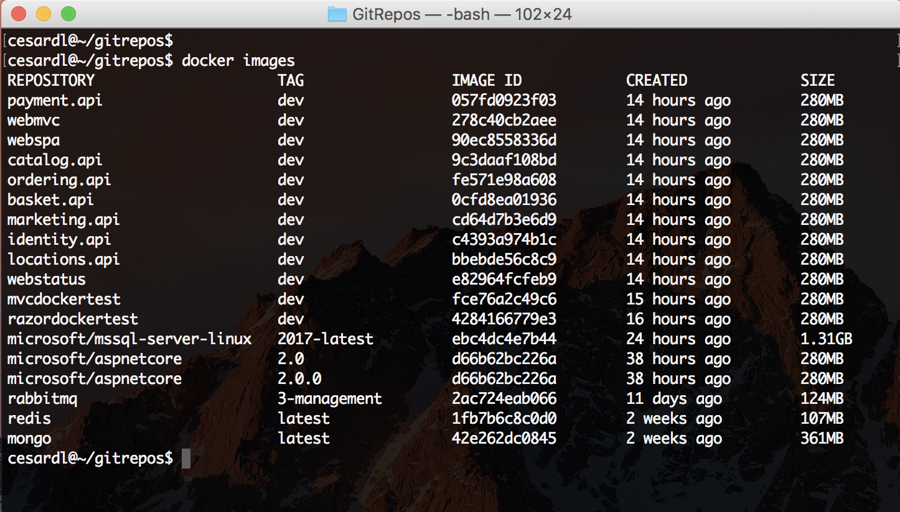

And by typing `docker ps` you can see the containers running in Docker. The infrastructure containers like SQL, Redis, RabbitMQ plus the custom containers running Web API microservices and the web apps.

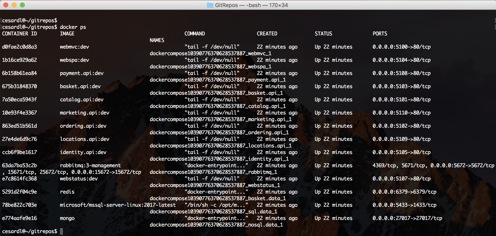

*IMPORTANT:* In order to have the full app working, like being able to login with a user and add items to the basket and create orders, or being able to consume the services from a remote Xamarin or web SPA, you need to configure additional steps for the app, like the IP to be used by the Identity Service because it needs to be redirected, etc. - Check the additional configuration at the end of this post.

## Explore the code

You should be now ready to begin learning by [exploring the code](Explore-the-code) and debugging eShopOnContainers.

## Configuring the app for external access from remote client apps

If using the services from remote apps, like the a phone with the Xamarin mobile app in the same Wifi network, or the web apps accessing remotely to the Docker Host, you need to change a few by-default URLs.
 
eShopOnContainers app uses the .env file to set certain by-default environment variables used by the multiple docker-compose.override you can have.

Therefore, the following change must be done in the .env file at the root of the eShopOnContainers folder.
If you don't see the .env file, run the following command and re-start the Finder:

 ```bash
    $ defaults write com.apple.finder AppleShowAllFiles TRUE

    $ killall Finder
 ```
Then, edit the .env file (with VS code, for instance) and change the ESHOP_EXTERNAL_DNS_NAME_OR_IP variable, and instead of using "localhost" as value, set a real IP or a real DNS name:

     `
        ESHOP_EXTERNAL_DNS_NAME_OR_IP=192.168.0.25
     `
or
     `
        ESHOP_EXTERNAL_DNS_NAME_OR_IP=myserver.mydomain.com
     `
This is something you'll want to do if deploying to a real Docker Host, like in a VM in Azure, where you can use a DNS name for that.
