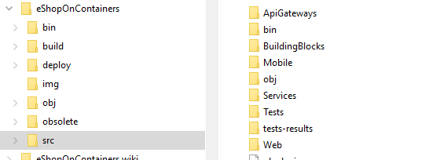

> **CONTENT**

- [2019-11-26 - Release 3.0.0](#2019-11-26---release-300)
  - [Highlights](#highlights)
  - [Details](#details)
    - [New folder structure](#new-folder-structure)
    - [Retired deployment scenarios](#retired-deployment-scenarios)

## 2019-11-26 - Release 3.0.0

The latest [3.0.0 release](https://github.com/dotnet-architecture/eShopOnContainers/releases/tag/3.0.0) contains a **LOT** of changes and new features:

### Highlights

1. Update to .NET Core 3.0
2. Use of gRPC for microservice-to-microservice communication
3. Use of Envoy Proxy for BFF
4. Repo cleanup
5. Initial Service Mesh support
6. Revise deployment scenarios

### Details

- Migrate solution from ASP.NET Core 2.2 to 3.0 and update all projects to use the latest .NET Core 3.0 templates.

- Implement the new .NET Core 3.0 WorkerService in Ordering.API and other background processes.

- Improve Ordering.API
  - Group order items
  - apply discounts from Marketing.API

- Handle two deployment scenarios
  - Basic deployment, better for learning:
    - [CLI or Visual Studio Code](https://github.com/dotnet-architecture/eShopOnContainers/wiki/Windows-setup)
    - [Visual Studio (F5 experience)](https://github.com/dotnet-architecture/eShopOnContainers/wiki/Windows-setup#optional---use-visual-studio)
    - [Docker compose](https://github.com/dotnet-architecture/eShopOnContainers/wiki/Docker-compose-deployment-files)
    - [Local Kubernetes](https://github.com/dotnet-architecture/eShopOnContainers/wiki/Deploy-to-Local-Kubernetes)

  - Advanced deployment, complex but more real-life:
    - [Deploy to AKS with a Service Mesh for resiliency](https://github.com/dotnet-architecture/eShopOnContainers/wiki/Deploy-to-Azure-Kubernetes-Service-(AKS))
      - Sidecar implementation with Envoy/Linkerd
      - Improved API Gateway and resilience
      - gRPC for microservice-to-microservice communications

#### New folder structure

The repo also has a new, simpler, folder structure, as shown in the following image:

In the above image you can see that the first folder level contains, basically:

- **build**: Scripts for building Docker images.
- **deploy**: Scripts for deployment.
- **src**: All source projects, including tests.
  - **ApiGateways**: Envoy configuration and Aggregators source code.
  - **BuildBlocks**: Common components used by several projects.
  - **Mobile**: Mobile apps projects.
  - **Services**: Backend for all services. Including unit and functional tests for some projects.
    - Basket
    - Catalog
    - Identity
    - Location
    - Marketing
    - Ordering
    - Payment
    - Webhooks
  - **Tests**: General functional application tests.
  - **test-results**: Test results
  - **Web**: Web applications

#### Retired deployment scenarios

- Service Fabric & Service Fabric Mesh.
- Kubernetes using YAML (only Helm charts are supported)
- CLI scripts for build and push (docker-compose and docker multi-stage are used)
