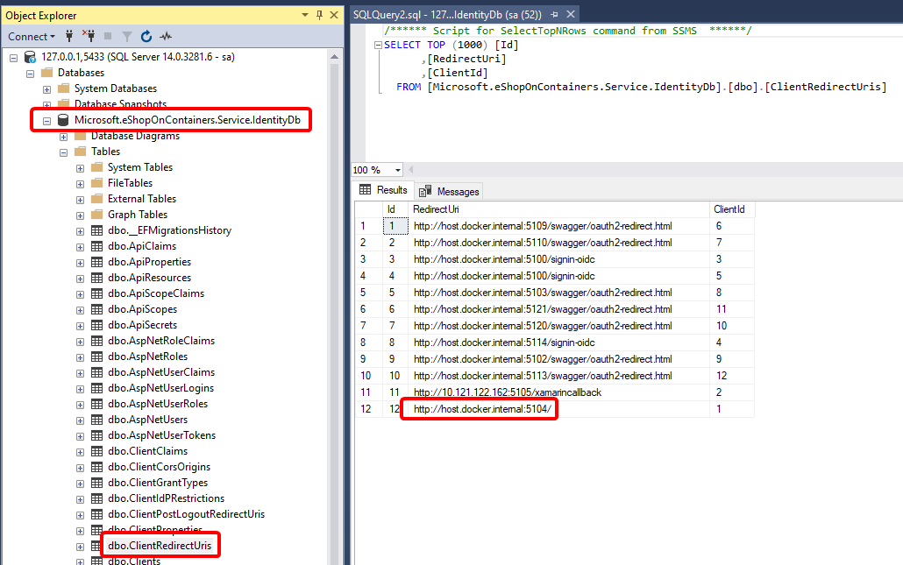
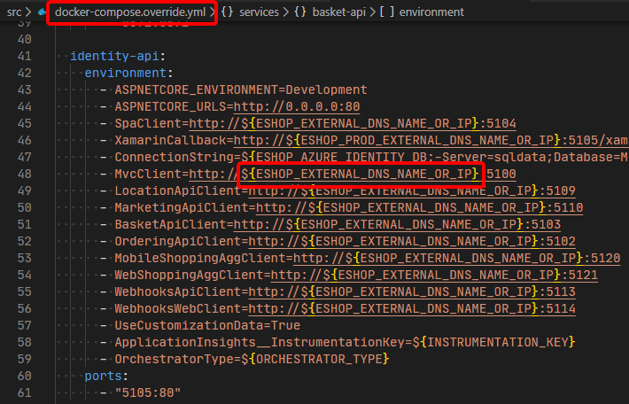

> **CONTENT**

- [Causes](#causes)
  - [Client not registered in Identity Server](#client-not-registered-in-identity-server)
  - [Docker Desktop upgraded to 2.2 and higher](#docker-desktop-upgraded-to-22-and-higher)
  - [Not starting from the correct address](#not-starting-from-the-correct-address)
- [Details](#details)
  - [Identity Server](#identity-server)
  - [Startup address](#startup-address)
- [Solutions](#solutions)

## Causes

### Client not registered in Identity Server

This error occurs because the connecting app (the "Client") isn't registered in the IdentityServer database as an authorized client.

The authorized client registration occurs when the Identity DB is seeded, and in eShopOnContainers this happens when the DB is first created. So this only happens when first installed or when restarting the Identity service if the DB has been deleted.

When registering the clients, eShopOnContainers reads the values from the following configuration variables, from either the `appsettings.json` file, the `docker-compose.override.yml` file or the equivalent environment variables:

```yaml
- SpaClient
- MvcClient
- LocationApiClient
- MarketingApiClient
- BasketApiClient
- OrderingApiClient
- MobileShoppingAggClient
- WebShoppingAggClient
- WebhooksApiClient
- WebhooksWebClient
```

### Docker Desktop upgraded to 2.2 and higher

Docker [removed DockerNAT in Docker Desktop Community 2.2](https://docs.docker.com/docker-for-windows/release-notes/#known-issues-1) so you can't use `localhost` to access a container and you must switch to `host.docker.internal`

### Not starting from the correct address

This can be the result of any, or a combination, of the two causes above.

## Details

### Identity Server

IdentityServer uses the `RedirectUri` to decide if the connecting client is authorized

When a user that's not been authorized tries to use the [client] app, they are  redirected to the IdentityServer's `/connect/authorize` endpoint, and the request includes a redirection uri that's used to complete the login process, as shown in the following image:


The authorized clients are registered in the `Clients` table and the related redirect URIs in the `ClientRedirectUris` table as shown in the following image:



It's important to keep in mind that if the application is registered as `http://host.docker.internal:5004` but started as `http://localhost:5104` it's considered to be a different one, so it'll get the `unauthorized_client` message.

### Startup address

The startup address is defined in the `.env` file and used in `docker-compose.override.yml` as shown in the following images.

**.env file**


**cocker-compose.override.yml** file



## Solutions

So the possible solution could be one or a combination of:

1. Make sure you are starting the app from the correct address.

2. Update the `.env` file as needed.

3. Update the `ClientRedirectUris` table to the correct values.

4. Drop the `IdentityDb` database and restart the `Identity` service, after updating the `docker-compose.override.yml` file, or the `configmap.yaml` in Kubernetes, so that all the clients are registered correctly.
